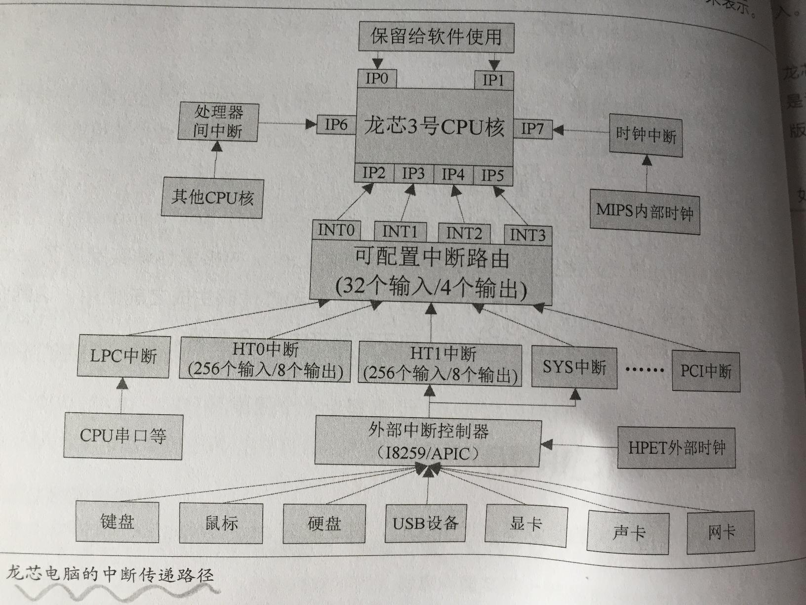

# 第１章基础知识
* 龙芯CPU基于MIPS架构

## 1.1 龙芯处理器简介
* 龙芯1号系列处理器与MIPS32 R2（MIPS R2的32位版本）兼容
* 龙芯2E、2F与MIPS III兼容
* 龙芯2G、2H、3A1000、3B1000、3B1500与MIPS64 R1（MIPS R1的64位版本）兼容
* 龙芯3A2000、3A3000与MIPS64 R2（MIPS R2的完整版）兼容
* 上述（MIPS R2 .xxx）内这些MIPS版本指的是体系结构，即指的是指令集ISA，不是具体的CPU设计
> MIPS公司早期自己生产处理器，现在只对设计授权，不自己生产CPU

* 龙芯处理器在指令集以外的部分的许多设计跟R4000相似（如时钟源、Cache、MMU、FPU的设计等）
> R4000又称r4k

### 1.1.1 龙芯3号功能特征
### 1.1.2 龙芯3号处理器核
### 1.1.3 龙芯电脑基本结构

## 1.2 Linux内核简介
### 1.2.1 Linux内核发展简史
### 1.2.2 Linux内核的开发模式
* 在代码仓库管理上，有主线仓库（mainline）、稳定仓库（stable）、未来仓库（linux-next）和子系统仓库（subsystem）4大类
* 绝大多数开发者贡献的代码首先要接受子系统仓库管理员的审核，才能进入某个特定的子系统仓库；在进入子系统仓库以后，未来仓库会进行二次审核；二次审核通过以后，将进入主线仓库（偶尔也有跳过未来仓库，从子系统仓库直接进入主线仓库的情况）。可以说，代码进入子系统仓库才仅仅处于Alpha状态；进入未来仓库才算达到Beta状态；如果进入了主线仓库，就相当于达到RC状态或者Final状态，算是被官方采纳了。

#### 4类代码仓库
* 一、主线仓库
> 管理员: Linus Torvalds

> Git仓库地址：git://git.kernel.org/pub/scm/linux/kernel/git/torvalds/linux.gt

* 二、稳定仓库
> 管理员：Greg Kroah-Hartman等

> git仓库地址：git://git.kernel.org/pub/scm/linux/kernel/git/stable/linux-stable.git

* 三、未来仓库
> 管理员：Stephen Rothwell

> git仓库地址：git://git.kernel.org/pub/scm/linux/kernel/git/next/linux-next.git

* 四、子系统仓库　
> 子系统仓库为数众多，一般按体系结构（arch）、驱动类型（drivers）进行分类

> MIPS子系统管理员：Ralf Baechle

> MIPS子系统git仓库地址：git://git.kernel.org/pub/scm/linux/kernel/git/ralf/linux.git

> GPU子系统管理员David Airlie

> GPU子系统git仓库地址：git://people.freedesktop.org/~airlied/linux

* 内核根目录中的MAINTAINERS文件会列出所有现任管理员及其相关信息
> M开头的行：管理员姓名和电子邮箱

> L开头的行：开发交流的邮件列表

> S开头的行：维护状态

> F开头的行：主要源码路径

### 1.2.3 关于长期维护稳定版本
* 普通的stable版本的维护时间为3个月左右
> 当主线仓库中下一版本发布，上一版本的stable分支就不再升级

### 1.2.4 龙芯的内核版本选型
* 官方内核是“内部完全自洽”的
* 同一个稳定分支的官方内核，版本号第三位越高越稳定

## 1.3 如何高效阅读代码
### 1.3.1 找准入口点
### 1.3.2 理清主脉络
### 1.3.3 顾名思义看功能
### 1.3.4 理解补丁文件
#### 用diff和patch这种原始命令来生成补丁和应用补丁
##### 生成补丁
* 假设当前目录下有linux-4.4.1和linux-4.4.2两个子目录，分别是两个内核不同版本的源代码目录。那么可以使用diff命令来导出一个变更集到补丁文件kernel.patch
```
diff -Naurp linux-4.4.1 linux-4.4.2 > kernel.patch
```

##### 应用补丁
* 进入linux-4.4.1目录，用patch命令来应用补丁文件kernel.patch将linux-4.4.1版本的源码变更成跟linux-4.4.2版本一致
```
patch -p1 < kernel.patch
```

##### 反向应用补丁
* 进入linux-4.4.2目录，用patch命令来应用补丁文件kernel.patch将linux-4.4.2版本的源码恢复成跟linux-4.4.1版本一致
```
patch -Rp1 < kernel.patch
```

#### 使用Git命令来导出和应用补丁文件
* Git中一个版本称为一个commit（提交），用一个40位的16进制数的散列值来表示
##### 导出简单格式补丁
```
git diff commit1 commit2 > kernel.patch
```

##### 应用简单格式补丁
```
git apply kernel.patch
```

##### 导出正规格式补丁
```
git format-patch commit1..commit2 -o kernel_patch_dir
```

##### 应用正规格式补丁
```
git am kernel_patch_dir/*.patch
```

* 正规格式补丁说明
> 如果commit1和commit2相邻，就导出一个补丁；如果不相邻，就会导出一系列补丁。这些补丁保存在kernel_patch_dir目录中，按版本从旧到新的顺序，以001-xxx-yyy.patch、002-xxx-yyy.patch的格式逐个命名

> 正规格式补丁导出以后可以直接以电子邮件的形式发送出去　

> 应用正规格式补丁的同时会自动提交到代码库

> 一个正规格式补丁文件包括4部分内容：头部信息、描述信息、正文区和脚注区

## 1.4 如何开发健壮内核
### 1.4.1内核代码风格
* 内核代码风格规范
> 中文版Documentation/zh_CN/CodingStyle

> 英文版Documentation/CodingStyle

### 1.4.2 合理生成补丁
* 合理使用git，牢记以下原则
> Git记录必须全程有机可回溯

> 补丁质量与代码质量同样重要

> 日志信息与代码质量同样重要

> 每次提交必须是一个完整的功能单位

* 提交日志应当如实描述补丁正文所做的事情，重点描述“为什么”和“怎么做”

### 1.4.3 谨慎对待创新
* 少即是多
* 向开源社区提交补丁与驱动程序的具体方法
> 中文版Documentatio/zh_CN/SubmittingPatches, SubmittingDrivers

> 英文版Documentation/SubmittingPatches, SubmittingDrivers, SubmitChecklist

# 第2章 内核启动解析
* 所有电脑开机以后首先执行的都是？基本输入输出系统（BIOS, Basic Input/Output System）
> BIOS存放在？只读存储器（ROM），是固化在硬件里的软件，即固件。

> BIOS的入口地址固定为？0xbfc00000，对应的物理地址为？0x1fc00000

> 龙芯上的BIOS主要有PMON和昆仑固件两种；PMON是MIPS平台上传统BIOS；昆仑固件是基于UEFI规范的BIOS

> BIOS在初始化硬件之后，通过启动加载器（BootLoader）来加载操作系统内核，然后由内核全面接管整个电脑的控制权

* 启动参数主要包括
> 1.指定根文件系统的参数，如root=/dev/sda1

> 2.指定控制台设备的参数，如console=tty

> 3.指定init程序路径的参数，如init=/sbin/init

> 完整的内核启动参数列表可参数内核自带文档Documentation/admin-guide/kernel-parameters.txt

*龙芯电脑操及其操作系统启动过程总述
```

　 --------              --------              ----                     --------------------
　|上电开机|----------->|昆仑固件|----------->|Grub|------------------>|读取grub.cfg显示菜单|
   --------              --------              ----                     -------------------- 
       |                                                                          |
       |                                                                          V
       |                 --------               --------------------        -------------------------
       ---------------->|  PMON  |------------>|读取boot.cfg显示菜单|----->|Linux 内核vmlinux/vmlinuz|------------- 
                         --------               --------------------        -------------------------             |
                                                                                    |                             |
										    |                             |
										    V                             |
								         ------------------------------           |
									|初始化内存盘(initrd/initramfs)|	  |  
									 ------------------------------           |
									             |                            | 
										     |                            |
										     V                            |
								           ------------------------------         |
									  |  init进程（SysVinit/Systemd）|<--------
                                                                           ------------------------------
									                 |
											 |
											 V
							   ----------		 -----------------             ----------
							  | 图形模式 | <--------|   各种系统服务  |---------->| 命令模式 |
							   ----------		 -----------------             ----------
								|		                                    |
								|			                            |
								V			                            V  
					          ---------------------------	   			 ------------------------
						 |登录管理器(KDM/GDM/LightDM)|	   			| 登录提示符(getty&login)|
						  ---------------------------	   			 ------------------------
                                                               |                                                      |
							       |                                                      |
							       V                                                      V
						 -----------------------------    			     -------------------         
						| 桌面环境(KDE/GNOME/Mate/DDE)|   			    |命令解释器（Shell）|
						 -----------------------------    			     -------------------
						               |                           			      |
							       |                           			      |
							        ------------------------------------------------------
								        		     |
											     V
											 -----------
											|  启动完成 |
											 -----------
```  

## 2.1 内核源码目录结构
* 内核的启动过程实际上就是各个子系统的初始化过程
* 龙芯是多核处理器，在操作系统启动完成后，每个核都是对称的。但是在启动过程中，编号为0的核承担着更多的责任，它是第一个启动的核，在它启动完成之后，才会唤醒其他核
> 0号核也叫启动核或主核

* 在Linux内核中，比"核"更通用的说法是逻辑cpu，一个逻辑cpu就是一个执行任务的最小单位
> 在单核处理器中，逻辑cpu就是物理cpu

> 在多核单线程处理器中，逻辑cpu就是核

> 在单核多线程或者多核多线程处理器中，逻辑cpu就是线程

> 前面说的启动核或主核实际上指的就是启动逻辑cpu和非启动逻辑cpu

## 2.2 内核启动过程：主核视角
* vmlinux, vmlinuz说明
> vmlinux是编译内核产生的ELF可执行内核文件，它是非压缩版本的原始内核

> vmlinuz是将vmlinux压缩以后再加上一个新的ELF头而得到的压缩版本内核

> BIOS即可以启动压缩版本内核，也可以启动原始内核

> 如果启动的是压缩版本内核，在解压前真正的入口是arch/mips/boot/compressed/head.S中的start标号；压缩版本内核在start标号处开始执行时通过decompress_kernel()进行自解压，解压内容释放到内存里形成一个原始内核。解压完毕后，执行流程跳转到原始内核的kernel_entry入口

* 主核的入口点是编译内核时确定的
> 根据内核是否压缩，主核的入口点分成两种

```c
/* 1、未压缩版本的原始内核vmlinux对应的内核的初始入口位于arch/mips/kernel/head.S中的Kernel_entry
 * 
 * 2、压缩版本内核vmlinuz，在解压缩之前真正的入口是arch/mips/boot/compressed/head.S中的start标号
 */
```

### 2.2.1 第一入口：kernel_entry
```
# MIPS汇编写的第一入口kernel_entry

NESTED(kernel_entry, 16, sp)                    # 函数头, 函数名：kernel_entry，栈帧大小16字节，返回地址为SP寄存器的内容
	kernel_entry_setup			# CPU具体类型相关初始化
	setup_c0_status_pri			# 设置主核协处理器0中Status寄存器的初始状态
	PTR_LA t0,	0f		        # 宏指令PTR_LA用于将一个变量的地址加载到寄存器；在32位时宏展开为la, 在64位配置下宏展开为dla
	jr		t0

0:
	PTR_LA		t0, __bss_start
	LONG_S		zero, (t0)
	PTR_LA		t1, __bss_stop - LONGSIZE

1:
	PTR_ADDIU	t0, LONGSIZE
	LONG_S		zero, (t0)
	bne		t0, t1, 1b
	LONG_S		a0, fw_arg0        #保存寄存器a0的内容到内存变量fw_arg0中，作用：保存a1中命令行参数中包含的参数个数
	LONG_S		a1, fw_arg1        #命令行参数, commandline; a0~a3中保存的是BIOS或引导程序传递给内核的参数
	LONG_S		a2, fw_arg2        #龙芯3号以前是key=value；龙芯3号开始是一个指向BIOS中一片数据区的地址，数据区有丰富的数据结构，有丰富的接口信息(见arch/mips/include/asm/mach-loongson64/boot_param.h是UEFI的LEFI接口规范), 其中有cpu和内存分布图定义
	LONG_S		a3, fw_arg3
	MTC0		zero, CP0_CONTEXT
	PTR_LA		$28, init_thread_union #用init_thread_union的地址来初始化GP，GP也叫全局指针，用于访问全局数据，$28代表28号通用寄存器
	PTR_LI		sp, _THREAD_SIZE - 32 - PT_SIZE     # 宏指令PTR_LI用于将一个立即数加载到寄存器; 使用宏指令是为了兼容32,64位内核
	PTR_ADDU	sp, $28
	back_to_back_c0_hzard
	set_saved_sp 	sp, t0, t1
	PT_SUBU		sp, 4 * SZREG
	j		start_kernel		# 跳转到第二入口start_kernel
	END(kernel_entry)                  # 标识函数结尾
```

#### 重要步骤：kernel_entry_setup, setup_c0_status_pri, PTR_LI sp, _THREAD_SIZE - 32 - PT_SIZE说明
* kernel_entry_setup
```
// arch/mips/include/asm/mach-loongson64/kernel-entry-init.h

	.macro	kernel_entry_setup
#ifdef CONFIG_CPU_LOONGSON3
	.set	push
	.set	mips64
	/* 设置*/
	mfc0	t0, CP0_CONFIG3
	or 	t0, (0x1 << 7)
	mtc0	t0, CP0_CONFIG3
	/* 打开ELPA（Enable Large Physical Address, 48位地址空间）功能 */
	...
	/* 如果是龙芯3A2000或更新的处理器就打开SFB功能 */
	...
2:
	_ehb
	.set	pop
#endif
	.endm
```

* setup_c0_status_pri
> 用于设置主核（启动核，或称为启动逻辑cpu）协处理器0（协处理器0是个什么东西？）中Status寄存器的初始状态

> 龙芯协处理器0的Status寄存器各bit位定义

|31～28|27|26|25～24|23|22|21|20|19|18～16|15～8|7|6|5|4～3|2|1|0|
|:-|:-|:-|:-|:-|:-|:-|:-|:-|:-|:-|:-|:-|:-|:-|:-|:-|:-|
|CU3~CU0|0|FR|0|PX|BEV|0|SR|NMI|0|IM7~IM0|KX|SX|UX|KSU|ERL|EXL|IE|

> 源码
```
// arch/mips/kernel/head.S
```

* init_thread_union相关（PTR_LI sp, _THREAD_SIZE - 32 - PT_SIZE）
> 在Linux中，进程和线程都是运行的程序实体，区别是进程有独立的地址空间，线程共享进程的地址空间，也就是说线程是一种特殊的进程；在Linux中线程的容器不是进程，而是线程组。例如，一个运行中的多线程程序是一个线程组，里面包含多个线程；一个运行中的单线程程序也是一个线程组，里面包含一个线程。

> 在windows操作系统中，进程是运行的程序实体，而线程是进程中的独立执行路径，也就是说，进程是容器，线程是容器中的执行体 

> 内核本身也可以视为一个特殊的进程，它可以派生出很多共享地址空间的内核线程，因此这个拥有很多线程的内核又可以视为一个特殊的线程组

> 一些重要的数据结构

```c
union thread_union {
	struct task_struct task;
	struct thread_info thread_info; // 不同的体系结构可以选择使用task_struct或是thread_info中的一个, MIPS选择的是thread_info
	unsigned long stack[THREAD_SIZE/sizeof(long)];
};

struct task_struct init_task = {
	.state		= 0,
	.stack		= init_stack,
	.tasks		= LIST_HEAD_INIT(init_task.tasks),
	.comm		= INIT_TASK_COMM,
	.thread		= INIT_THREAD,
	...
};

#define INIT_TASK_DATA(align)			\
	. = ALIGN(align)			\
	__start_init_task = .;			\
	init_thread_union = .;			\
	init_stack = .;				\
	KEEP( *(.data..init_task))		\          // KEEP(后面的空格完全是为了适应markdown, 不加空格时文件内容显示的状态不对
	KEEP( *(.data..init_thread_info))	\
	. = __start_init_task + THREAD_SIZE;	\
	__end_init_task = .;
	

unsigned thread_union init_thread_union; 	// 0号进程的thread_union
struct thread_info init_thread_info __init_thread_info = INIT_THREAD_INFO(init_task); // ???
unsigned long init_stack[THREAD_SIZE / sizeof(unsigned long)];
unsigned long kernelsp[NR_CPUS]; // 存放栈指针？
```

> 每个进程用一个进程描述符struct task_struct表示

> 每一个进程都有一个和体系结构相关的线程信息描述符struct thread_info 

> 每一个进程都有一个内核栈，用于处理异常、中断或者系统调用

> Linux内核为每一个进程分配一个大小为THREAD_SIZE（一般为一页大小）的内存区，用thread_union结构把task_struct, thread_info, 内核栈三个东西放在一起保存

> 0号进程一开始就是内核自身，在完成启动、初始化之后，变成idle进程

> 对于多核或多处理器系统，每个逻辑cpu都有一个0号进程； 请问每个0号进程都相同吗？因为上面定义的全局的init_thread_union只有一个, init_thread_info也只有一个

> 0号进程的thread_union是init_thread_union; thread_info是init_thread_info;内核栈是init_stack

> 每个逻辑cpu在处于内核态时都有一个当前内核栈，其栈指针就是kernelsp[]数组

### 2.2.2 第二入口：start_kernel
* 原始版本内核: BIOS->kernel_entry->start_kernel

* 压缩版本内核：BIOS->start->kernel_entry->start_kernel

#### start_kernel代码树
```c
start_kernel()
	|---------smp_setup_processor_id();
	|---------cgroup_init_early();
	|---------local_irq_disable();  // 关中断
	|---------boot_cpu_init(); // 设置cpu的存在性状态（有四种possible, present, online, active）
			|-------------cpu = smp_processor_id();
			|-------------set_cpu_online(cpu, ture);  // 在线
			|-------------set_cpu_active(cpu, true);  // 在线并处于活动状态
			|-------------set_cpu_present(cpu, true); // 表示物理上确实存在
			|-------------set_cpu_possible(cpu, true);// 表示物理上可能存在
			\-------------__boot_cpu_id = cpu;
	|---------page_address_init();
	|---------setup_arch(&command_line); 		// 根据体系结构进行相关的初始化
	|---------setup_command_line(command_line);	// 建立内核命令行参数
	|---------setup_nr_cpu_ids();
	|---------setup_per_cpu_areas();		// 建立每CPU变量区
	|---------smp_prepare_boot_cpu();		// 体系结构相关函数，用于把0号逻辑CPU设置成possible、present状态
	|---------boot_cpu_hotplug_init();		// 将启动核，即当前核设置成online状态
	|---------build_all_zonelists(NULL, NULL);
	|---------page_alloc_init();
	|---------parse_early_param();
	|---------vfs_caches_init_early();
	|---------trap_init();				// 异常初始化, 与体系结构相关，非常重要
	|---------mm_init();				// 内存管理初始化
			|-------mem_init();		// 建立内存分布图（将BootMem/MemBlock内存分布图转换为伙伴系统内存分布图，对每个页帧调用set_page_count()设置引用计数为0
			|-------kmem_cache_init(); 	// 完成slab内存对象管理器初始化
			|-------kmemleak_init();	// 内核内存泄漏扫描器初始化
			\-------vmalloc_init();		// 非连续内存区管理器初始化
	|---------sched_init();		// 调度器初始化，完成后主核就可以进行任务调度了
			|-------for_each_possible_cpu(i) { // 循环初始化每个CPU的运行队列rq（用于进程组织和调度，包括cfs, rt, dl这3个子队列）
					rq = cpu_rq(i);
					init_cfs_rq(&rq->cfs);
					init_rt_rq(&rq->rt);
					init_dl_rq(&rq->dl);
					...
				}
			|-------set_load_weight(&init_task); // 设置init_task的负荷权重
			|-------init_idle(current, smp_processor_id());		// 将内核自己进程化，从现在开始内核也是一个“进程”了，即0号进程
			\-------init_sched_fair_class();
	|---------radix_tree_init();
	|---------workqueue_init_early();	// 工作队列初始化，第一部分创建7个系统级工作队列
	|---------rcu_init();			// 初始化RCU子系统
	|---------early_irq_init();		// 初始化中断描述符（irq_desc[NR_IRQS]数组, 包含中断号的芯片数据irq_data和中断处理程序irqaction）
	|---------init_IRQ();		// 这是真正的设置中断描述符中的数据，它与体系结构相关；early_irq_init是将数据设置成no_irq_chip, 处理程序设置成handle_bad_irq()
	|---------tick_init();
	|---------rcu_init_nohz();
	|---------init_timers();	// 基本定时器初始化
	|---------hrtimers_init();	// 高分辨率定时器初始化
	|---------softirq_init();	// 软中断初始化
	|---------timekeeping_init();	// 初始化各种时间变量，如jiffies, xtime
	|---------boot_init_stack_canary();
	|---------time_init();		// 与体系结构相关，进一步初始化计时系统
	|---------perf_event_init();	// PerfEvents性能剖析工具初始化
	|---------profile_init();	// OProfile性能剖析工具初始化
	|---------call_function_init();            // 这之前是第一阶段，单线程关中为阶段 ; 到这里为止，中断相关的初始化都已经完成，可以开中断了 
	|---------local_irq_enable();              // 第二阶段从这里开始
	|---------console_init();			// 控制台初始化
	|---------setup_per_cpu_pageset();
	|---------numa_policy_init();		// NUMA内存分配策略初始化
	|---------acpi_early_init();
	|---------sched_clock_init();
	|---------calibrate_delay();		// 计算loops_per_jiffy（每个时钟节拍对应的循环次数，这个值用于实现各种delay()函数）
	|---------pid_idr_init();
	|---------anon_vma_init();
	|---------thread_stack_cache_init();
	|---------fork_init();			// 初始化fork()函数用到的一些数据结构, 如创建名为“task_struct”的slab对象
	|---------proc_caches_init();
	|---------buffer_init();
	|---------key_init();
	|---------security_init();
	|---------vfs_caches_init();
	|---------pagecache_init();
	|---------signals_init();		// 与信号相关的数据结构初始化。
	|---------proc_root_init();
	|---------cpuset_init();
	|---------cgroup_init();		// CGroup相关数据结构初始化，并创建sysfs, procfs节点
	|---------acpi_subsystem_init();
	\---------arch_call_reset_init();         // 第二阶段到这里结束，开中断单线程阶段
			\-------------rest_init();      // 第三阶段从这里开始，开中断、多线程阶段
					|---------kernel_thread(kernel_init, NULL, CLONE_FS); // 创建1号进程kernel_init
					|---------numa_default_policy();
					|---------kernel_thread(kthreadd, NULL, CLONE_FS | CLONE_FILES);// 创建2号进程kthreadd
					\---------cpu_startup_entry(CPUHP_ONLINE); 
							\--------while (1) do_idle(); // 内核现在主要工作是休息
									\-------cpuidle_idle_call();
											\-------default_idle_call();
												   \--------arch_cpu_idle();
												        	\--------cpu_wait();
```

* 大致可以将整个start_kernel()过程分为3个大的阶段：关中断单线程阶段、开中断单线程阶段、开中断多线程阶段

* 第一阶段：关中断单线程阶段 
> 为什么要关中断？启动初期中断处理的基础设施尚未准备好。关中断是一个体系结构相关的操作，对于MIPS就是将协处理器0中Status寄存器中的IE位清0

> kernel_entry将控制权移交给start_kernel时就是关中断状态的，这也解释了为什么start_kernel函数不是第一句就执行local_disable_irq来关中断

> boot_cpu_init()用于设置启动cpu的存在性状态，有四种存在性状态：possible, present, online, active

> present与possible的区别：这与cpu物理热插拔有关，默认这两个值相关，当物理上移除一个cpu时，present数目会减少一个

> present与online的区别：这与cpu的逻辑热插拔有关，在不改变硬件的情况下，可以对/sys/devices/system/cpu/cpuN/online写0来关闭一个cpu，写1打开一个cpu

> online表示这个cpu可以调度任务了

> active表示可以往这个cpu迁移任务了

> online与active的区别：在通过逻辑热插拔关闭一个cpu的过程中，被关闭的cpu首先必须退出active状态，然后才能退出online状态

> setup_command_line()用于建立命令行参数。内核命令行参数可以写在启动配置文件（boot.cfg或grub.cfg）中，由BIOS或启动器（Bootloader, 如grub）传递给内核；也可以在编译内核时指定为缺省参数。该函数会将各个来源的参数综合在一起，处理成最终状态

> 普通数组中每个元素在内存中是相邻的

> 每cpu数组在内存中不相邻，每CPU数组中的每个元素位于不同的Cache行

> 把每cpu数组设计成跨cache line的作用：修改某个CPU的元素不会让另一个CPU的元素因为同在一个cache line而被污染，因而可以更有效利用cache; 这是典型的空间换时间

> 时间变量jiffies记录了系统启动以来的经历的节拍数；xtime记录的时间可以精确到纳秒

> 对于龙芯平台来说，第一阶段除了关中断以外，还有一大特点是：显示器上没有任何输出信息。因为龙芯内核使用哑控制台作为初始控制台，没有从BIOS继承任何可以显示的控制台信息

* 第二阶段：开中断单线程阶段
> 现在已经是开中断，尽管现在是单线程，但一旦产生中断就会切换控制流

> 这一阶段除了按顺序执行代码流程外，还可能以交错方式执行中断处理程序代码

> console_init()，控制台初始化。在内核中，控制台基于“键盘 + 鼠标 + 显示器”的VTConsole, 基于串口的SericalConsole，基于IP网络的NetConsole三类。console_init()要完成上述三类控制台的初始化，该函数执行完成后显示器上依然没有输出信息，但是所有的准备工作都已经做好了，包括启动徽标已经在内存VTConsole的屏幕缓冲区中绘制好了，只要显卡初始化一完成，基于FrameBuffer的FBConsole就会代替DummyConsole，从而输出显示信息（将显示内容从VTConsole的屏幕缓冲区复制到显卡的帧缓存FrameBuffer）

> 信号之于进程，好比中断之于内核。信号用于打断当前的执行流程，去完成一些更重要的工作

> CGroup全称Control Group（控制组），是内核中一种控制资源分配的机制

> 第二阶段完成所有调度有关的子系统初始化，这样在下一阶段就可以创建内核线程了，可以以并发的方式继续内核启动了

> 因显卡还未初始化，所以第二阶段显示器上无输出

* 第三阶段：开中断多线程阶段
> 1号、2号进程实际上是两个内核线程

> 2号进程是除0、1、2号进程以外其他所有内核线程的祖先

> 1号进程和2号进程创建以后，内核自己的初始化工作就基本完成了，余下的工作交给1号进程和2号进程

> 内核初始化的最后一步是执行cpu_startup_entry，通过执行do_idle()函数让0号进程（内核）休息，（如果别的进程有事要做，就调度别的进程，反之意味着系统空闲，回到0号进程，而0号进程本身就是idle进程，内核本身）

> 在SMP系统上，1号进程会打开所有其他CPU／核，让后面的内核启动真正并行起来。包括显卡驱动在内的各种设备驱动都在1号进程里完成

> 在这一阶段，显示器上在部分时间是有输出信息的

### 2.2.3 重要函数：setup_arch()
```c
// arch/mips/kernel/setup.c
setup_arch()
	|---------cpu_probe();	// 探测CPU类型, 依据32位PRID寄存器（高8位保留，次高8位存公司ID，第三个8位存处理器ID，最后一个8位存修订号）
			|---CaseA: cpu_probe_legacy(c, cpu); 		// 无公司ID时用 legacy
			|---CaseB: cpu_probe_loongson(c, cpu);		// 龙芯3A2000后有公司ID，用loonsgon
			|---CaseC: others
	|---------prom_init(); 					// P Rom , 指BIOS芯片，通过BIOS传递来的信息来初始化
			|---prom_init_cmdline(); 		// 处理fw_arg0（参数个数）, fw_arg1（字符串数组）
			|---prom_init_env(); 			// 用fw_arg2初始化环境变量
			|---loongson_pch->early_config(); 	// 龙芯芯片组（ls2h, ls7a, rs780）相关初始化
				\---ls2h_early_config()/ls7a_early_config();/rs780_early_config();
			|---prom_init_memory(); / prom_init_numa_memory(); 	// 内存分配图初始化（根据是否为numa来选择这两个函数之一）
			|---prom_init_uart_base();				// 初始化CPU串口的基地址
			|---register_smp_ops(&loongson3_smp_ops);		// 初始化龙芯多核支持的SMP操作函数集
			|---board_ebase_setup = mips_ebase_setup;
			\---board_nmi_handler_setup = mips_nmi_setup;
	|---------arch_mem_init(cmdline_p);
			|---plat_mem_setup();		// 设置系统控制台（如果配置了VGA控制台，那么系统控制台就是vga_con，否则是哑控制台）
			|---bootmem_init();		// 建立boot_mem_map内存映射图
			|---device_tree_init();		// 校验解析并初始化设备树 
			|---sparse_init();		// 稀疏型内存模型初始化 
			\---plat_swiotlb_setup();	// DMA地址-物理地址的软件中转站SWIOTLB初始化
	|---------plat_smp_setup();
			\---mp_ops->smp_setup();
				\---loongson3_smp_setup();
	|---------prefill_possible_map();
	|---------cpu_cache_init();
			|---r4k_cache_init();
			\---setup_protection_map();
	\---------paging_init();			// 初始化各内存页面管理区(zone)
```

> prom_init_memory()完成内存分布图初始化。以numa版本的内存分布图初始化函数prom_init_numa_memory()来说，它首先初始化NUMA节点的距离矩陈，然后逐个解析内存分布图并将最终结果保存于loongson_memmap中，最后建立逻辑CPU和节点的映射关系（即CPU拓扑图）。非numa版本是一个简化版本只解析节点0的内存映射

> NUMA节点距离矩陈用于描述跨节点访问内存的代价。在linux系统里可以使用numactl --hardware来查看节点距离矩陈

> CPU拓扑图和节点距离矩陈是紧密相关的，节点距离矩陈只描述了各节点之间的距离，并没有描述各个核（逻辑CPU）之间的距离。因此有了CPU拓扑图，就知道哪个核属于哪个节点，哪个节点包括哪些核，这样才能知道任意两个核之间的距离

> boot_mem_map是BootMem内存分布图，它主要是给BootMem内存分配器使用，只包含系统内存

> loongson_memmap是BIOS内存分布图，记录了包括NUMA节点和多种内存类型在内的更多信息

> 如果启动时配置了initrd/initramfs，那么bootmem_init()还有一个功能就是通过init_initrd()处理initrd/initramfs的起始地址、结束地址和设备节点，再通过finalize_initrd()将initrd/initramfs所在的内存段设置为保留。Linux5.4已经淘汰BootMem而全面使用MemBlock

> 内存模型指的是物理地址空间分布的模型，Linux内核支持3种内存模型：平坦型、非连续型、稀疏型内存模型

> 包括龙芯在内的现代体系结构大多采用了比较自由的稀疏型内存模型

> SWIOTLB，这是一种DMA API。龙芯3号的访存能力是48位，但是由于芯片组或者设备本身的限制，设备的访存能力往往没有这么大。比如龙芯的顶级I/O总线（HT总线）位宽只有40位，一部分PCI设备的访存能力只有32位，而ISA/LPC设备的访存能力甚至只有24位。为了让任意设备能够对任意内存地址发起DMA访问，就必须在硬件上设置一个“DMA地址－物理地址”的翻译表，或者由内核在设备可访问的地址范围内预先准备一块内存做中转站。许多X86处理器在硬件上提供翻译表（IOMMU）；龙芯没有IOMMU，于是提供了软件中转站，也就是SWIOTLB

> plat_swiotlb_setup()初始化SWIOTLB元数据并注册DMA API操作集loonson_dma_map_ops, DMA API与芯片组相关

> LS2H芯片组：物理地址转DMA地址使用loongson_ls2h_phys_to_dma()；DMA地址转物理地址使用loongson_ls2h_dma_to_phys()

> LS7A：物理地址转DMA地址使用loongson_ls7a_phys_to_dma(); DMA地址转物理地址使用loongson_ls7a_dma_to_phys()

> RS780E: 物理地址转DMA地址使用loongson_rs780_phys_to_dma(); DMA地址转物理地址使用loongson_rs780_dma_to_phys()

> plat_smp_setup()

```c
struct plat_smp_ops loongson3_smp_ops = {
	.send_ipi_single = loongson3_send_ipi_single, 	// 用于核间通讯
	.send_ipi_mask = loongson3_send_ipi_mask,
	.smp_setup = loongson3_smp_setup,		// 在主核上执行，用于启动辅核
	.prepare_cpus = loongson3_prepare_cpus,		// 在主核上执行, 用于启动辅核
	.boot_secondary = loongson3_boot_secondary,	// 在主核上执行, 用于启动辅核
	.init_secondary = loongson3_init_secondary,	// 在辅核上执行
	.smp_finish = loongson3_smp_finish,		// 在辅核上执行
#ifdef CONFIG_HOTPLUG_CPU
	.cpu_disable = loongson3_cpu_disable,		// 用于CPU热插拔
	.cpu_die = loongson3_cpu_die,			// 用于CPU热插拔
#endif
};
```

> smp_setup()->loongson3_smp_setup()建立CPU逻辑编号与物理编号对应关系；初始化IPI寄存器的地址和操作函数；确定主核的封装编号和核编号

> 为什么会有CPU逻辑编号和物理编号？这与保留掩码是否为0有关，当所有核都投入使用时保留掩码为0；当一部分核不使用时，保留掩码非0，这意味着投入使用的核不一定从0开始也不一定编号连续，但是Linux内核的很多数据结构和核心代码假定逻辑CPU的编号从0开始并且连续，所以需要区分物理编号和逻辑编号。内核提供了两个数组来管理：__cpu_number_map[]（用于物理编号到逻辑编号的映射）, __cpu_logical_map[]（用于逻辑编号到物理编号的映射）

> IPI（处理器间中断，Inter-Processor Interrupt）是核间通信的机制。每个CPU核对应有8个IPI寄存器（IPI_Status, Enable, Set, Clear, Mailbox0~3），前4个寄存器是32位，分别表示32种IPI，Mailbox寄存器64位，用于传递中断以外的更多信息。

> IPI_Status是状态寄存器（只读），某一位为1表示收到了某种IPI

> IPI_Enable是使能寄存器，往某一位写1表示允许某种IPI

> IPI_Set是触发寄存器，往某一位写1表示触发某种IPI

> IPI_Clear是清除寄存器，往某一位写1表示清除某种IPI

> prefill_possible_map()建立合理的逻辑CPU的possible值，它依据在启动参数nr_cpus和编译配置NR_CPUS中取最小值。获取到合理的possible值后，会调用set_cpu_possible()来更新cpu_possible_mask，最后将possible值赋给全局变量nr_cpu_ids

> paging_init()，初始化各个内存页面管理区。在初始化每个zone时，会调用init_page_count()将每个页帧的初始引用计数设置为1。因为此时此刻内存还处于BootMem管理器控制，这些页帧尚未转交到伙伴系统（内存页帧管理器），不是自由页帧，不可以被伙伴系统的页帧分配函数分配

#### 各种地址的定义
* 虚拟地址
> 也叫逻辑地址或程序地址，是从CPU角度看到的地址，也是写在代码里的那个地址。引入虚拟地址的主要原因是支持多任务。因为有了虚拟地址及其地址空间的隔离，多个任务才能使用同样的程序地址并发地跑在同一个CPU上（实际每个任务占用的是不同的物理内存）。

* 线性地址
> 在x86里，表示虚拟地址经过段转换得到的地址，实模式下等于物理地址，保护模式下需要经过页转换才能得到物理地址。在龙芯里，不需要经过页转换的虚拟地址即为线性地址，如32位地址空间里的KSEG0、KSEG1地址以及64位地址空间里的XKPHYS地址

* 物理地址
> 表示虚拟地址或线性地址（x86）经过页转换得到的地址。龙芯的线性地址不需要页转换，直接去掉类型前缀就可以得到物理地址。值得注意的是，此处的物理地址是“初始物理地址”，是CPU核的地址总线发出的地址；其要经过各级交叉开关的转换才能得到“最终物理地址”，即内存条上的地址

* 总线地址
> 也叫DMA地址，是从设备角度看到的地址，在没有IOMMU时等于物理地址，在有IOMMU时经过简单转换可以得到物理地址

#### 页面管理区zone 
* ZONE_DMA
> 包括所有物理地址小于16MB的页面

> 设置这个区的目的：为ISA/LPC等DMA能力只有24位地址的设备服务

* ZONE_DMA32
> 包括所有ZONE_DMA区之外的物理地址小于4GB的页面

> 设置这个区的目的：是为DMA能力只有32位地址的PCI设备服务

* ZONE_HIGHMEM
> 设置这个区的目的：是为物理地址超过线性地址表达能力的内存服务

> 对于32位的MIPS内核，线性地址表达能力只有512MB，因此512MB以外的页面被放置到ZONE_HIGHMEM区

> 对于64位的MIPS内核，物理地址暂时还没有超过线性地址表达能力，因此通常不设置ZONE_HIGHMEM区 

* ZONE_NORMAL
> 该区包含了前面几个区以外的所有页面

#### MIPS的虚拟地址分成3类
* 不缓存并且不分页的，这种虚拟地址既不需要Cache也不需要TLB

* 缓存但不分页的，这类地址需要Cache但不需要TLB

* 缓存并且分页的，这类地址既需要Cache也需要TLB

#### MIPS的虚拟地址空间划分
* 32位地址空间

|起始地址|空间名称|缓存吗？|分页吗？|
|:-|:-|:-|:-|
|0xC000 0000|KSEG2(1GB)|缓存|分页|
|0xA000 0000|KSEG1(512MB)|不缓存|不分页|
|0x8000 0000|KSEG0(512MB)|缓存|不分页|
|0x0000 0000|USEG(2GB)|缓存|分页|

* 64位地址空间
> 下图表中给出的是64位地址空间划分的最大能力，不是当前状态

|起始地址|空间名称|缓存吗？|分页吗？|权限|
|:-|:-|:-|:-|:-|
|0xFFFF FFFF C000 0000|CKSEG2(1GB)||||
|0xFFFF FFFF A000 0000|CKSEG1(512MB)||||
|0xFFFF FFFF 8000 0000|CKSEG0(512MB)||||
|0xC000 0000 0000 0000|XKSEG(4EB-2GB)|缓存|分页|只有内核可访问|
|0x8000 0000 0000 0000|XKPHYS(4EB)|是否缓存由地址的59～61位决定|不分页||
|0x4000 0000 0000 0000|XSSEG(4EB)||||
|0x0000 0000 0000 0000|XUSEG(4EB)|||用户态唯一可访问的地址段；内核当然也可以|

### 2.2.4 重要函数：trap_init()
* trap_init()的主要工作是CPU异常的初始化，大致可分为
> 准备工作

> 每CPU配置

> 建立异常向量表

```c
trap_init()
	|-----check_wait(); 		// 设置cpu_wait函数指针
	|-----ebase = CAC_BASE; / ebase = CKSEG0ADDR(ebase_pa);
	|-----if (board_ebase_setup) board_ebase_setup();
	|-----per_cpu_trap_init(true);
		|-----configure_status(); 			// 配置Status寄存器
		|-----configure_hwrena();			// 配置HWREna寄存器
		|-----configure_exception_vector();		// 配置异常向量的入口地址（主要是EBase寄存器）
		|-----if (!is_boot_cpu) cpu_cache_init();
		|-----tlb_init(); 	// 内核使用微汇编器动态生成TLB异常处理函数；因为TLB异常调用频率高，所以性能要求也非常高，所以。。
			\---build_tlb_refill_handler(); // 设置第一层次的向量0（TLB重填异常）、向量1（XTLB重填异常）
		\-----TLBMISS_HANDLER_SETUP();
			\---TLBMISS_HANDLER_SETUP_PGD(swapper_pg_dir);
	|------set_handler(0x180, &except_vec3_generic, 0x80); /* 设置向量3的处理函数，即except_vec3_generic(), 这个函数根据异常号查询第二层次的异常向量表exception_handlers[32]数组，如果匹配，则调用相应的处理函数*/
	|------for (i = 0; i <= 31; i++) set_except_vector(i, handle_reserved);
	|------set_except_vector(EXCCODE_INT, using_rollback_handler()?rollback_handle_init:handle_int);
	|-----/* 用set_except_vector()设置其他异常向量，方法同上 */
	|------board_nmi_handler_setup();
		\---mips_nmi_setup();
			\---memcpy(base, &except_vec_nmi, 0x80);
	|------board_cache_error_setup();
		\---r4k_cache_setup();
			\---set_uncached_handler(0x100, &except_vec2_generic, 0x80);
	\------local_flush_icache_range(ebase, ebase + vec_size); // 刷新EBase地址开始的一段内存，保证动态生成的代码被真正写入了内存，并且保证I-Cache里的内容不是过期的代码
```

> MIPS指令集中定义了WAIT指令，用作暂停流水线，降低空闲时CPU功耗。类似于x86的HLT指令。龙芯3A1000以前的CPU没有实现WAIT指令；龙芯3A2000以后的CPU实现了真正的WAIT指令，此时cpu_wait被设置成标准的r4k_wait()；其他龙芯处理器保持为空

> EBase寄存器，重定位寄存器：协处理器0中的EBase寄存器。EBase寄存器中的地址默认为CKSEG0（0xffff ffff 8000 0000）

> 龙芯处理器异常分类

|异常类型|异常入口（BEV=0）|异常入口（BEV=1）|
|:-|:-|:-|
|硬复位、软复位、NMI|0xffff ffff bfc0 0000|0xffff ffff bfc0 0000|
|TLB重填|0xffff ffff 8000 0000|0xffff ffff bfc0 0200|
|XTLB重填|0xffff ffff 8000 0080|0xffff ffff bfc0 0200|
|Cache错误|0xffff ffff a000 0100|0xffff ffff bfc0 0300|
|其他通用异常（包括陷阱、断点、系统调用、保留指令、地址错误、中断等）|0xffff ffff 8000 0180|0xffff ffff bfc0 0200|
|EJTAG调试（ProbeEn =0）|0xffff ffff bfc0 0480|0xffff ffff bfc0 0480|
|EJTAG调试（ProbeEn =1）|0xffff ffff ff20 0200|0xffff ffff ff20 0200|

> BEV是协处理器0中Status寄存器的BEV位，处理器刚上电时BEV＝1，但在内核刚刚开始的时候，在kernel_entry入口开始就把BEV清0了, 所以对于上表只需关心BEV=0的情况

> 硬复位、软复位和NMI是非常紧急或致命的异常，它们的异常处理程序入口地址永远是0xffff ffff bfc0 0000（BEV=0或BEV=1都是），这个地址也是所有MIPS处理器上电以后PC的初始值; 也就是说这几个异常的处理一直在BIOS里

> TLB重填和XTLB重填是调用频率非常高的异常，因此设置了专门的异常入口

> Cache错误发生时，cache本身不可用，因此cache错误的入口默认在CKSEG1段偏移为0x100的地方

> 其他各种通用异常共享同一个中断入口，默认在CKSEG0段偏移为0x180的地方

> 龙芯处理器在0xffff ffff bfc0 0000开始的1MB空间实际上不是内存空间，而是映射到BIOS的ROM芯片。因此当BEV＝1时，实际上所有异常均在BIOS里面处理，当操作系统启动过程中清BEV以后，TLB重填、XTLB重填、Cache错误和其他通用异常才会转由内核进行处理，其余几种异常依旧在BIOS里进行

#### per_cpu_trap_init()进行每CPU配置, 顾名思义，每CPU配置就是每个逻辑CPU都需要执行一次的配置
* config_status()执行的结果是：
> 协处理器0可用, 其他协处理器不可用

> 32个双精度浮点寄存器可用

> 64位核心地址空间段、管理地址空间段、用户地址空间段均被启用

> 异常向量入口地址使用运行时向量（BEV＝0），因为异常向量表马上就要建立起来了

#### 建立异常向量表（set_handler函数开始到trap_init结束）
* 异常向量有两个层次
> 第一层次：向量0（TLB重填异常），向量1（XTLB重填异常），向量2（高速缓存错误），向量3（其他通用异常）；这一层次一共有4个向量，每个向量有不同的入口地址，由硬件负责分发；

> 第二层次：向量3实际上是一个共享入口，必须做一个分发；这个层次共32个向量，它们的入口地址相同但有不同的编号，由软件负责分发

### 2.2.5 重要函数： init_IRQ()
```c
// arch/mips/kernel/irq.c

init_IRQ()
	\-----arch_init_irq();
		\---mach_init_irq();
			|-----irqchip_init();
				|---mips_cpu_irq_init();
					\---__mips_cpu_irq_init();
				\---CaseA: ls2h_irq_of_init();
				    CaseB: ls7a_irq_of_init();
				    CaseC: i8259_of_init();
				    	\---__init_i8259_irqs();
			|-----loongson_pch->init_irq();
				\---CaseA: ls2h_init_irq();
				    CaseB: ls7a_init_irq();
				    CaseC: rs780_init_irq();
			|-----irq_set_chip_and_handler(LOONGSON_UART_IRQ, &loongson_irq_chip, handle_percpu_irq);
			|-----irq_set_chip_and_handler(LOONGSON_BRIDGE_IRQ, &loongson_irq_chip, handle_percpu_irq);
			\---set_c0_status(STATUSF_IP2 | STATUSF_IP3 | STATUSF_IP6);
```

#### 龙芯电脑的中断传递路径


* 从最核心的CPU核来看，所有的MIPS处理器在这个层面都有8个中断源（IP0～IP7）

* IP7固定作为时钟中断，其中断源为MIPS内部时钟

* CPU中断路由有32个输入（中断源），4个输出INT0～INT3（对应IP2～IP5）

* 32个输入中常用的分为5大类：
> 来自于CPU内部LPC中断（如CPU内置串口和其他ISA/LPC设备）

> 来自于CPU内部PCI中断（目前的PCI/PCIE设备均连接在桥片上的PCIE控制器上，内部PCI控制器未使用）

> 来自于HT0中断（HT0用于芯片互联）

> 来自于HT1中断（可连接外部中断控制器）

> 来自于SYS中断（可连接外部中断控制器）

* LS2H、LS7A芯片组使用APIC中断控制器

* RS780+SB700芯片组使用I8259中断控制器

* MSI中断：消息中断

* 龙芯总共定义了256个中断号（IRQ），LS2H、LS7A和RS780这3类机型的中断号分配如下
> LS2H芯片组：

|中断号|中断|说明|
|:-|:-|:-|
|IRQ0～15|APIC的LPC中断|低速设备外部中断，级联在IRQ77下面|
|IRQ16～55|MSI中断||
|IRQ56～63|MIPS经经典的CPU中断|包括内部时钟中断|
|IRQ64～159|APIC的常规中断|高速设备外部中断|
|IRQ160～255|MSI中断||

> LS7A芯片组：

|中断号|中断|说明|
|:-|:-|:-|
|IRQ0～15|APIC的LPC中断|低速设备外部中断，级联在IRQ83下面|
|IRQ16～55|MSI中断||
|IRQ56～63|MIPS经经典的CPU中断|包括内部时钟中断|
|IRQ64～127|APIC的常规中断|高速设备外部中断|
|IRQ128～255|MSI中断||

> RS780芯片组：

|中断号|中断|说明|
|:-|:-|:-|
|IRQ0～15|I8259中断|外部中断|
|IRQ16～55|MSI中断||
|IRQ56～63|MIPS经经典的CPU中断|包括内部时钟中断|
|IRQ64～255|MSI中断||

* 龙芯推荐的中断路由配置中，内部LPC中断（包括CPU串口）路由到0号核的IP2（即INT0）

* 中断路由配置时只允许0号核直接处理中断，这就有可能导致0号核的中断负担过重; 为了实现中断负载均衡，可以通过处理器间中断来完成外部中断的软件转发，因此需要一个IRQ->IPI_OFFSET的映射表

* IRQ相关的数据结构
```c
struct irq_desc { // 用来描述IRQ
	struct irq_data		irq_data;
	irq_flow_handler_t	handle_irq; /* 高层中断处理函数，它针对IRQ，与之对应的还有一个针对底层设备的irqaction.handler处理函数；高层中断处理函数可能会被设置成handle_percpu_irq()、handle_level_irq(), handle_edge_irq()*/
	struct irqaction	*action;    /* irqaction组成一个链表，当某个IRQ被触发，handle_irq()就会被调用，然后handle_irq()会遍历irqaction链表，逐个调用action里的handler()*/
	...
	const char		*name;
};

struct irq_data {
	unsigned int		irq;
	struct irq_chip		*chip;
	...
	struct irq_common_data	*common;
};

struct irq_chip {
	const char		*name;
	unsigned int	(*irq_startup)(struct irq_data *data);
	void 		(*irq_shutdown)(struct irq_data *data);
	void 		(*irq_enable)(struct irq_data *data);
	void 		(*irq_disable)(struct irq_data *data);
	void 		(*irq_ack)(struct irq_data *data);
	void 		(*irq_mask)(struct irq_data *data);
	void 		(*irq_unmask)(struct irq_data *data);
	void 		(*irq_eoi)(struct irq_data *data);
	int		(*irq_set_affinity)(struct irq_data *data, const struct cpumask *dest, bool force);
	...
};

struct irq_common_data {
	cpumask_var_t		affinity;
	...

};

struct irqaction {
	irq_handler_t		handler; /* 底层中断处理函数，它针对具体的设备；它被称为中断服务例程ISR（Interrupt Service Rountine）；底层中断处理函数需要到具体注册中断时才能设置 */
	struct irqaction	*next;
	struct task_struct	*thread;
	irq_handler_t		thread_fn;
	...
};
```

### 2.2.6 重要函数：time_init()
> 该函数用于计时系统初始化，它与体系结构相关

```c
time_init()
	|-----plat_time_init();
		\---setup_hpet_timer(); 	// 建立HPET的ClockEvent
	|-----mips_clockevent_init();
		\---r4k_clockevent_init();	// 建立MIPS的ClockEvent
	\-----init_mips_clocksource();
		\---init_r4k_clocksource();	// 建立MIPS的ClockSource

/* 问题
 * 1. HPET的ClockSource为何不建立？
 *    答：ClockEvent是不能运行时切换的，只能在初始化时决定，因此这里HPET, MIPS的ClockEvent都进行了初始化;
 *        ClockSource是可以运行时切换的，因此这里只初始化了MIPS的，而HPET的ClockSource被延后了
 *
 * 2. MIPS时钟源和HPET时钟源都初始化了，在运行时选择哪一个？
 *    答：
 *        根据时钟源的评分值来决定选择哪一个时钟源。每个时钟源都有一个rating值，它表示时钟源的评分值，它的取值范围是1～500，分越高越会被选用。
 * 	  因为只有0号核能收到外部中断，那么也只有0号核能使用HPET时钟源当ClockEvent，其他核使用MIPS当ClockEvent;
 */
```

#### 背景知识
* TimeKeeping, 时间维护、或称为计时；计时最基本的功能是：获取当前时间（Time Of Day，TOD）；进程调度、软件定时、电源管理、性能采样统计、网络时间协议（NTP）都建立在TOD概念之上

* 计时功能的实现依赖硬件上的时钟源，硬件上的时钟源分成两类：周期性时钟源和无节拍时钟源
> 周期性时钟源，也叫固定节拍时钟源。这类硬件时钟源周期性地发射时钟中断，作为计时的主要依据; 周期的单位是HZ；SMP系统中，周期性时钟源由0号CPU维护

> 无节拍时钟源，它的硬件时钟源根据需要选择性发射时钟中断，以此作为计时的主要依据。SMP系统中，无节拍时钟源由各个CPU轮流维护

* ClockEvent时钟源
> 它是基于中断的时钟源

> 是本地的，每个逻辑CPU都有一个

* ClockSource时钟源 
> 它由CPU主动读取它的计数器值，是一般意义上的时钟源

> 它是全局的，所有逻辑CPU共用一个

* 内部时钟源
> 每个核都有一个，在每个核上都能产生中断

> 例如在龙芯CPU上，CP0的Count/Compare这一对寄存器就是一种内部时钟源（一般称为MIPS时钟源），Count寄存器是一个计数器，随着时间的流逝而增长，其增长频率与CPU主频成正比关系；当Count寄存器的值增长到与Compare寄存器的值相同时，就产生一次时钟中断

> MIPS内部时钟源可以作为ClockEvent, 或ClockSource；不过因为ClockSource是全局的，所以在多核环境下需要保证每个核的Count寄存器是同步的

* 外部时钟源
> 在CPU外部，如：PIT（可编程间隔定时器）、HPET（高精度事件定时器）

> 外部时钟源的中断不一定能路由到任意一个CPU核

> 外部时钟源的中断与CPU频率无关

> 可作为ClockEvent或ClockSource，不过因为ClockEvent基于中断，所以如果在中断路由上有所限制，那么只有在单核时才能作为ClockEvent

#### 计时的基本方式
* ClockEvent时钟源每隔固定长度时间给系统发送一个时钟中断，每次中断称为一个节拍（tick），记录节拍的总数就可以得到粗粒度的当前时间x（毫秒级）；通过亚节拍修正，即，在x加上一个ClockSource计算得到的时间偏移量，就可以得到微秒级的当前时间

* 由于一些限制因素（CPU热恋插拔、动态调频、中断路由），单纯使用内部时钟或外部时钟源的计时方法很难做到精确，所以龙芯采用了混合时钟源计时方法

### 2.2.7 1号进程：kernel_init()
* 内核在sched_init()完成后化身为0号进程，在rest_init()中创建1号进程、2号进程，然后就化身为空闲进程，休息去了。后续的系统启动步骤，由1号进程接管，1号进程的执行函数是kernel_init()

```c
// init/main.c

kernel_init()
	|-----kernel_init_freeable();
		|-----smp_prepare_cpus(setup_max_cpus);
			|-----init_new_context(current, &init_mm);	// 初始化1号进程地址空间, 因为1号进程现在还是内核线程，所以它共享0号进程地址空间init_mm
			|-----current_thread_info()->cpu = 0;		// 现在投入运行的只有0号核
			|-----mp_ops->prepare_cpus(max_cpus);
				\---loongson3_prepare_cpus();		// 将cpu_present_mask设置成与cpu_possible_mask相同 
			|-----set_cpu_sibling_map(0);			// 设置0号CPU的线程映射图
			\---set_cpu_core_map(0);			// 设置0号逻辑CPU的核映射图
		|-----workqueue_init();			// 创建初始的工作者线程(kworker)
		|-----do_pre_smp_initcalls();		// 执行所有用early_initcall()定义的initcall函数
		|-----smp_init();		  	// 启动多核 
			|-----idle_threads_init();	// 给每个辅核创建0号进程
			|-----for_each_present_cpu(cpu) cpu_up(cpu);	// 循环把每个present状态的CPU都启动起来
				\---do_cpu_up(cpu);
					\---_cpu_up(cpu);
						|-----idle = idle_thread_get(cpu);
						\---cpuhp_up_callbacks(cpu, st, CPUHP_BRINGUP_CPU);
							\---bringup_cpu(cpu);
								\---__cpu_up(cpu, idle);
									|-----mp_ops->boot_seondary(cpu, tidle);
										\---loongson3_boot_secondary(cpu, tidle);
									\---synchronise_count_master(cpu);
			\---smp_cpus_done(setup_max_cpus);
		|-----sched_init(smp);
			|-----sched_init_numa();
			\---sched_init_domains(cpu_active_mask);
		\---do_basic_setup();
			|-----driver_init();
				|-----devtmpfs_init();
				|-----devices_init();
				|-----buses_init();
				|-----classes_init();
				|-----firmware_init();
				|-----hypervisor_init();
				|-----of_core_init();
				|-----platform_bus_init();
				|-----cpu_dev_init();
				|-----memory_dev_init();
				\---container_dev_init();
			\---do_initcalls();
				\---for (level = 0; level < 8; level++) do_initcall_level(level);
	|-----numa_default_policy();
	|-----CaseA: run_init_process(ramdisk_execute_command);
	|-----CaseB: run_init_process(execute_command);
	|-----CaseC: run_init_process("/sbin/init");
	|-----CaseD: run_init_process("/etc/init");
	|-----CaseE: run_init_process("/bin/init");
	|-----CaseF: run_init_process("/bin/sh");
```

> 1号进程的生命周期分成两个阶段：内核态阶段和用户态阶段

> 1号进程刚创建出来的时候是一个内核线程，它的工作是接管0号进程的内核启动过程；当这一阶段完成，它就装载用户态的init程序，变身为一个用户进程，成为所有其他用户态进程的鼻祖；

> 1号进程在内核态阶段主要执行kernel_init_freeable()

> 到现在为止，整个系统依然只有一个CPU在运行，但1号进程会负责把所有逻辑CPU都启动

#### 单处理器阶段
* kernel_init_freeable()的第一步：准备工作
* kernel_init_freeable()的第二步：smp_prepare_cpus() 

* kernel_init_freeable()的第三步：workqueue_init()
* kernel_init_freeable()的第四步：do_pre_smp_initcalls()
> 该函数用于执行所有用early_initcall()定义的initcall函数 

> Linux内核初始化段一览表 

|段名|标记方法|功能描述|
|:-|:-|:-|
|.init.text|__init|初始化代码|
|.init.data|__initdata|初始化数据|
|.init.setup|early_param/__setup/__setup_param|启动参数|
|.initcallearly.init|early_initcall|早期initcall函数|
|.initcall0.init|pure_initcall|第0级initcall函数|
|.initcall1.init/.initcall1s.init|core_initcall/core_initcall_sync|第1级initcall函数|
|.initcall2.init/.initcall2s.init|postcore_initcall/postcore_initcall_sync|第2级initcall函数|
|.initcall3.init/.initcall3s.init|arch_initcall/arch_initcall_sync|第3级initcall函数|
|.initcall4.init/.initcall4s.init|subsys_initcall/subsys_initcall_sync|第4级initcall函数|
|.initcall5.init/.initcall5s.init|fs_initcall/fs_initcall_sync|第5级initcall函数|
|.initcallrootfs.init|rootfs_initcall|Rootfs级initcall函数|
|.initcall6.init/.initcall6s.init|device_initcall/device_initcall_sync|第6级initcall函数|
|.initcall7.init/.initcall7s.init|late_initcall/late_initcall_sync|第7级initcall函数|

> 这些初始化段按表中的顺序放在相邻的内存中，所有初始化段的起始地址是__init_begin, 结束地址是__init_end;启动参数段的起始地址是__setup_start, 结束地址是__setup_end；所有initcall函数的起始地址是__initcall_start, 结束地址是__initcall_end 

> rootfs_initcall用于建立初始化内存盘（initrd/initramfs）中的根文件系统

> module_init()定义的函数分两个应用场景：此类函数被直接编译到内核，那么它等价于device_initcall；如果此类函数被编译到模块里，则在内核启动完成后，由1号进程间接调用

* kernel_init_freeable()的第五步：smp_init()
> 龙芯的主核是通过Mailbox寄存器来启动辅核的。自BIOS或Bootloader把控制权交给内核以后，主核一始执行内核代码，而辅核一直在轮询各自的Mailbox寄存器。loongson3_boot_secondary()通过Mailbox寄存器来传递辅核启动需要的信息。启动信息包括：入口地址，初始的SP和GP。辅核的入口地址是smp_bootstrap;SP和GP的计算方法跟主核一样，都是用0号进程的thread_info算出来的，只不过主核自己算，而辅核是主核算好然后直接通过Mailbox传递给辅核。

> 龙芯的每个核有4个Mailbox寄存器，Mailbox0用于传递入口地址，Mailbox1用于传递SP，Mailbox2用于传递GP（辅核自己的0号进程的thread_info），Mailbox3暂时未用

* kernel_init_freeable()的第六步：sched_init_smp()
> sched_init_numa()，根据NUMA结构建立节点间的拓扑信息

> sched_init_domains()，建立节点内的拓扑信息

> 到这里为止，所有的辅核都已经启动，kernel_init_freeable正式进入多处理器并行状态

#### 多核处理器阶段
* do_basic_setup->driver_init(), 早期Linux使用devfs来创建/dev目录下的设备结节，但从Linux-2.6.13版本开始采用udev后，从此绝大部分设备节点都是在运行时候动态创建的。但是有一些基本设备节点非常重要，必须在内核启动的过程中创建，比如/dev/console, /dev/zero, /dev/null等

* do_basic_setup->do_initcalls(), 用于处理Early后面的8个级别的initcall；对应每个级别会调用do_initcall_level->initcall
> 重要的initcall函数

|函数名|级别|功能描述|
|:-|:-|:-|
|loongson_cu2_setup()|early_initcall|注册协处理器2的异常处理函数|
|cpu_stop_init()|early_initcall|创建停机迁移内核线程（migration）|
|spawn_ksoftirqd()|early_initcall|创建软中断内核线程（ksoftirqd）|
|init_hpet_clocksource()|core_initcall|注册HPEI的ClockSource|
|pm_init()|core_initcall|电源管理初始化|
|cpuidle_init()|core_initcall|CPUIdle核心初始化|
|cpufreq_core_init()|core_initcall|CPUFreq核心初始化|
|init_per_zone_wmark_min()|core_initcall|计算每个内存管理区的水位线和保留量|
|isa_bus_init()|postcore_initcall|ISA总线驱动初始化|
|pci_driver_init()|postcore_initcall|PCI总线驱动初始化|
|loongson3_platform_init()|arch_initcall|执行龙芯3号的platform_controller_hub中的pch_arch_initcall()函数指针|
|loongson3_clock_init()|arch_initcall|初始化龙芯3号CPU的频率表|
|loongson_cpufreq_init()|arch_initcall|注册龙芯2号和龙芯3号的CPUFreq设备|
|loongson_pm_init()|arch_initcall|注册龙芯2号和龙芯3号的平台睡眠操作函数集|
|pcibios_init()|arch_initcall|注册PCI控制器|
|pcibios_init()|subsys_initcall|枚举所有PCI设备|
|alsa_sound_init()|subsys_initcall|声卡驱动核心初始化|
|md_init()|subsys_initcall|MD（RAID与LVM）初始化|
|usb_init()|subsys_initcall|USB驱动核心初始化|
|init_pipe_fs()|fs_initcall|PIPE（管道）文件系统初始化|
|inet_init()|fs_initcall|因特网协议族初始化|
|cfg80211_init()|fs_initcall|CFG80211（WIFI）核心初始化|
|populate_rootfs()|rootfs_initcall|建立initrd/initramfs中的根文件系统|
|loongson3_device_init()|device_initcall|执行龙芯3号的platform_controller_hub中的pch_device_initcall()函数指针|
|pty_init()|device_initcall|伪终端设备（PTY）驱动初始化|
|kswapd_init()|module_init|创建kswapd内核线程|
|cpufreq_init()|module_init|龙芯CPU的CPUFreq驱动初始化|
|loongson_hwmon_init()|module_init|龙芯CPU温度传感器驱动初始化|
|lemote3a_laptop_init()|module_init|Leote（龙梦）笔记本电脑平台驱动初始化|
|ahci_init()|module_init|AHCI（SATA控制器）驱动初始化|
|ohci_hcd_mod_init()|module_init|注册USB1.0主机驱动（OHCI）|
|ehci_hcd_init()|module_init|注册USB2.0主机驱动（EHCI）|
|xhi_hcd_init()|module_init|注册USB3.0主机驱动（EHCI）|
|usb_stor_init()|module_init|USB存储设备（U盘）驱动初始化|
|drm_core_init()|module_init|DRM（显卡驱动）核心初始化|
|radeon_init()|module_init|AMD Radeon显卡驱动初始化|

> 当各个initcall函数执行完毕，1号进程的内核态阶段也即将结束。接下来它将先通过numa_default_policy()将1号进程自己的NUMA内存分配策略改成MPOL_DEFAULT；然后通过run_init_process()->do_execve()来装入用户态的init程序，变身为普通进程。一旦用户态的init程序装入并开始执行，内核的启动过程就结束了

## 2.3  内核启动过程：辅核视角
* 辅核主要完成本地CPU相关的初始化，之后执行自己的0号进程进入idle循环，之后辅核就能进行任务调度了
* 辅核的启动也包括第一入口和第二入口

### 2.3.1 第一入口：smp_bootstrap
* 主核的入口地址是BIOS或BootLoader给出的
* 辅核的入口则是主核在执行smp_init()时传递的
```c
// arch/mips/kernel/head.S

NESTED(smp_bootstrap, 16, sp)
	smp_slave_setup			// 类似主核的kernel_entry_setup，对于龙芯来说完全一样
	setup_c0_status_sec		// 类似于主核的setup_c0_status_pri，只是增加了对BEV的清0，因为主核里已经建立好异常向量表，辅核直接用即可
	j	start_secondary		// 跳转到第二入口
	END(smp_bootstrap)
```

### 2.3.2 第二入口：start_secondary()
* 功能上类似主核的start_kernel()
```c
// arch/mips/kernel/smp.c

start_secodary()
	|-----cpu_probe();
	|-----per_cpu_trap_init(false);		// 辅核这里传的参数是false，主核是true, 这个值的不同会导致在per_cpu_trap_init中是否执行cpu_cache_init
		|-----configure_status();
		|-----configure_hwrena();
		|-----configure_exception_vector();
		|-----if (!is_boot_cpu) cpu_cache_init();
		|-----tlb_init();
			\---build_tlb_refill_handler();
		\---TLBmiSs_HANDlER_SETUP();
			\---TLBMISS_HANDLER_SETUP_PGD(swapper_pg_dir);
	|-----mips_clockevent_init();		// ClockEvent不是全局的，所以每个核都需要注册 
	|-----mp_ops->init_secondary();
		\---loongson3_init_secondary();	// SMP启动中mp_ops的第一个辅核步骤
	|-----calibrate_delay();		// 计算loops_per_jiffy（它的用途是确定delay()的时候每个节拍需要多少空操作指令）
	|-----notify_cpu_starting(cpu);
	|-----synchronise_count_slave(cpu);	// 与主核进行Count寄存器同步
	|-----set_cpu_online(cpu, true);	// 辅核把自己设置成online
	|-----set_cpu_sibling_map(cpu);		// 设置线程映射图
	|-----set_cpu_core_map(cpu);		// 设置核映射图
	|-----mp_ops->smp_finish();
		\---loongson3_smp_finish();	// SMP启动中mp_ops的第二辅核个步骤
	\---cpu_startup_entry(CPUHP_AP_ONLINE_IDLE);	// 辅核开始执行0号进程 
		\---while (1) do_idle();
			\---cpuidle_idle_call();
				\---default_idle_call();
					\---arch_cpu_idle();
						\---cpu_wait();
```

> SMP启动中mp_ops的第一个辅核步骤mp_ops->init_secondary()->loongson3_init_secondary()首先设置Status寄存器的IP位；然后把所有possible核的IPI_Enable寄存器的所有位置1，这意味着允许任意核上任意类型的IPI中断。接下来，计算辅核自己的封装编号与核编号。最后Count寄存器同步

> SMP启动中mp_ops的第二个辅核步骤mp_ops->smp_finish()->loongson3_smp_finish()

```c
static void loongson3_smp_finish(void)
{
	int cpu = smp_processor_id();
	write_c0_compare(read_c0_count() + mips_hpt_frequency / HZ);	// 在1个节拍后产生一次中断；mip_hpt_frequency是Count寄存器的增长频率，通常是CPU主频的一半
	local_irq_enable();		// 开中断，只有开了中断才有可能处理时钟
	loongson3_ipi_write64(0, (void*)(ipi_mailbox_buf[cpu_logical_map(cpu)] + 0x0)); 	/* 清空mailbox寄存器 */
}
```

# 第3章 异常与中断解析
* 异常/中断指的是出现了正常执行流程被打断的事件。这些个事件如果来自CPU内部，就叫异常；如果来自CPU外部，就叫中断。一般来说，异常是同步的，需要立即处理。而中断是异步的，通常会在一定程度上延迟处理
> 在MIPS处理器的分类中，中断被算作异常的一种。

* 异常、中断有什么用？
> 中断是为了CPU和外设可以并行工作而引入的一种机制

> 有了中断，CPU就可以一心一意地作自己的工作而不必轮询设备状态，直到中断发生再去为设备服务

> 正常情况下CPU是顺序执行，而异常可以让CPU交错执行，有了交错执行，CPU就拥有了并发特征，CPU有了并发特征，单核CPU上才可以运行多任务的可能

* 在Linux内核里，上下文用于描述当前的软硬件状态和环境
> 上下文分为进程上下文、中断上下文

> 中断上下文又细分为：不可屏蔽中断（NMI）上下文、硬中断上下文、软中断上下文

> 进程上下文细分为：可抢占进程上下文、不可抢占进程上下文

> CPU在处理不可屏蔽中断时，处于不可屏蔽中断上下文；CPU在处理硬件中断时，处于硬件中断上下文；CPU在处理软中断时，处于软中断上下文；其他时候（包括用户进程、内核线程、异常处理）CPU处于进程上下文

* 各个上下文的特点
> 硬中断上下文：不可被硬中断、不可被软中断、不可睡眠、不可抢占

> 软中断上下文：可以被硬中断，不可被软中断、不可睡眠、不可抢占

> 进程上下文：可以被硬中断、可以被软中断、可以睡眠，是否可以被抢占取决于有没有关抢占

* 内核提供以下宏来判断当前上下文状态
> in_irq()，是否处于硬中断上下文

> in_softirq()，是否处于软中断上下文

> in_nmi()，是否处于不可屏蔽中断上下文

> in_interrupt()，是否处于硬中断、软中断、nmi等中断上下文

> in_atiomic()，是否处于原子上下文

> in_task()，是否处于进程上下文

## 3.1 寄存器操作
* 进程在用户态运行时使用用户栈，进入内核态以后使用内核栈

* 从用户态切换到内核态时，需要将除K0/K1外的所有寄存器保存到内核栈

* 在保存寄存器上下文前，SP指向的是用户栈，因此首要的事情是切换SP，以下为切换用户栈到内核栈步骤：
> 备份用户栈指针：将旧SP值（用户栈指针）保存到K0

> 备份内核栈指针：使用get_saved_sp来获取当前进程在当前CPU上的内核栈指针并放入K1

> 将K1的值减去PT_SIZE（完整寄存器上下文大小）并写入SP，此时SP已经指向内核栈

* 内核态切换回用户态时，只需要恢复寄存器上下文中的SP就可以（？）

* 异常处理时发生的上下文切换只涉及一个进程，是同一个进程在“正常执行流”与“异常执行流”之间的切换

## 3.2 异常处理解析
### 3.2.1 复位异常和NMI
* 复位包括硬复位和软复位
> 硬复位异常在冷启动时发生，也就是说硬复位就是第一次开机上电

> 软复位异常在热启动时发生，也就是说在开机状态下执行重启操作将触发软复位

* NMI表示发生了非常严重的错误，通过CPU上专门的NMI引脚触发，因此不可屏蔽
> NMI直接跳到内核进行处理。内核的NMI处理入口是 except_vec_nmi()，定义在arch/mips/kernel/genex.S中, 最终调用nmi_exception_handler()执行关机或重启

* 复位异常和NMI有相同的入口地址0xffff ffff bfc0 0000
> 它们都由BIOS第一时间处理

* BIOS如何区分复位异常和NMI异常？
> 通过协处理器0中的Status状态寄存器，这3种异常发生时，硬件会根据情况设置Status寄存器的BEV、SR、NMI位
```
1. 硬复位：BEV=1, SR=0, NMI=0
2. 软复位：BEV=1, SR=1, NMI=0
3. NMI：BEV=1, SR=0, NMI=1
```

### 3.2.2 缓存错误异常
* Cache错误一旦发生，意味着Cache已经不可靠，接下来所有的取指令和内存访问都必须以非缓存的方式进行
> 内核本身存放的段可以被设置成以非缓存方式工作，但因为有动态生成的代码和数据不在内核所在的段上，所以对于Cache错误，实际上软件是无能为力。因此出现此种异常最终会调用panic()进入死机状态

> 龙芯3号处理器对Cache有纠错功能，但有些错误比较严重也会出现无法纠错的情况，那同样会死机

> 死机是种策略（由内核主动调用panic()函数实现），由上面对Cache错误的分析可知

### 3.2.3 TLB/XTLB异常
* CPU的内存管理单元叫MMU，而MMU包括TLB。TLB负责从虚拟地址到物理地址的转换，是内存中页表的一个子集
* 虚拟页和物理页的页内偏移相等，所以转换虚拟地址到物理地址只需要转换虚拟页号和物理页号
* 虚拟页号
> 多级页表可将虚拟页号拆分成PGD, PUD, PMD, PTE，这是四级页表

* 物理页号

* 64位MIPS处理器大多使用三级页表(PGD, PMD, PTE)
* 龙芯的PTE
```
--------------------------------------------------------------------------------------------
|   ___________________________________     ___________________________________________    |
|  |__VPN2__|__ASID__|__PageMask_|__G__|   |__PFN-0__|__Flags-0__|__PFN-1__|__Flags-1__|   |
|                                                                                          |
--------------------------------------------------------------------------------------------

/* VPN2，地址相邻的两个页面被放置在同一个页表项里，虚拟页号的高位部分叫VPN2，一对虚拟页面自然对应两个物理页面，即一对虚拟地址对应两个物理地址。因此一个VPN2对应PFN-0和PFN-1两个物理页号。
 * 
 * 物理页号是全局唯一的
 * 虚拟页号不是全局唯一的，因为每个进程都有自己的页表，为了防止虚拟地址冲突，TLB表项里加入了ASID来让VPN2+ASID保证唯一性，ASID约等于进程ID
 * 
 * G是全局标志位，G=1表示不需要匹配ASID。内核自己的页表一般会设置G=1
 *
 * PageMask是页面大小
 * Flags-0/1是页面属性标志，C是Cache属性，D表示可写位（D为1表示页面可写），V是有效位（V为1表示该TLB项有效）
 *
 * 龙芯的每个CPU核都有64项全相联的VTLB（V代表页面大小可变），全相联代表任意一个虚拟地址要以通过TLB中的任意一项来映射
 */
```

* 当TLB里面没有合适的条目可以翻译当前虚拟地址的时候，就会发生TLB异常
* TLB异常总共分4种：
> TLB/XTLB重填异常，意味着TLB中没有对应项

> TLB加载无效异常，表示读请求，TLB中有对应项，但对应项无效

> TLB存储无效异常，表示写请求，TLB中有对应项，但对应项无效

> TLB修改异常，写请求，TLB中有对应项，对应项有效，但只读

> 注：TLB/XTLB有专门的入口向量（向量01），其他几种异常使用通用入口向量（向量3）

> TLB重填异常用于32位模式，XTLB用于64位模式

#### 内核微汇编器原理
* TLB异常的处理函数不是静态编写的，而是在启动过程中用内核自带的微汇编器生成的动态代码 
* 龙芯TLB异常处理函数是靠什么生成的？如下这四个函数
> TLB/XTLB重填异常，build_r4000_tlb_refill_handler()

> TLB加载无效异常，build_r4000_tlb_load_handler()

> TLB存储无效异常，build_r4000_tlb_store_handler()

> TLB修改异常，build_r4000_tlb_modify_handler()

#### 龙芯TLB动态代码
* 以龙芯3号为例讲的龙芯TLB动态代码
> 已知的配置：龙芯3号可寻址范围是48位；

> 龙芯CPU虚拟地址的结构，即龙芯内核代码中的三级页表PGD只有47位，所以PGD地址范围小于CPU寻址能力, 所以需要其他代码来处理超出PGD范围的地址，这些地址被龙芯内核定义为非法地址，这些非法地址的处理会通过tlb_do_page_fault_0转移到do_page_fault()函数，最终结果是给应用程序发送“段错误”信号，终止其运行

* 虚拟地址分解
```
          -----------------------------------------------------------------
          |保留（17位）|PGD（11位）|PMD（11位）|PTE（11位）|Offset（14位）|  
	  -----------------------------------------------------------------
	               |           |           |           |<-PAGE_SHIFT->|
		       |           |           |<---PMD_SHIFT------------>|
		       |           |<---------PGD_SHIFT------------------>|
		       |<-------------整个PGDIR覆盖的地址范围------------>|
```

* 除TLB重填异常外，所有的TLB异常处理都分为快速路径、慢速路径
> 快速路径下，与给的虚拟地址对应的TLB项要么无效，要么有效无权限，但对应的页表项存在且有效有权限；因此，异常处理函数会访问相应的页表项并将其填到TLB中

> 慢速路径下，页表里面也不存在有效对应项（或者有效无权），因此需要通过tlb_do_page_fault_0（读操作触发的异常）或tlb_do_page_fault_1（写操作触发的异常）标号处的代码调用do_page_fault()进行缺页异常处理，建立有效页表项（或者处理权限问题）后再进行TLB装填

* 优化TLB重填异常
> 一个是在硬件层面上优化，一个是在软件层面上优化，这里我只关心软件层面的，软件上是如何优化的呢？高度精简。

> 软件精简举例，TLB重填异常处理只有快速路径，没有慢速路径，这并不是表示出现TLB重填异常时一定存在有效的页表项且权限正确，而是在发生TLB重填异常就把页表项装到TLB，不管页表项是有效是否有权限。如果有效有权则后面的执行一切正常；如果填到TLB的页表项是无效的，那么触发TLB重填异常的指令将再次触发TLB无效异常，在新的异常里面再进入慢速路径来建立有效页表项；如果填到TLB的页表项是无权限的，那么触发重填异常的指令会再次触发TLB修改异常，在新的异常里再进入慢速路径来处理权限问题

### 3.2.4 其他通用异常
* 通用异常有统一的入口except_vec3_generic，定义在arch/mips/kernel/genex.S中
> CAUSE寄存器的第2～6位标识了异常种类（异常编码）

> except_vec3_generic中先取出异常编码，以其为索引在exception_handler[]数组中找到正确的处理函数，然后跳转到处理函数

> exception_handler数组就是第二层次异常向量

* MIPS第二层次异常向量表

|异常编码|助记符|异常名称|处理函数|备注|由微汇编器动态生成|
|:-|:-|:-|:-|:-|:-|
|0|Int|中断|handle_init()|龙芯3A2000开始使用rollback_handle_init()|no, 单独定义|
|1|Mod|TLB修改异常|handle_tlbm()||yes|
|2|TLBL|TLB无效异常（读）|handle_tlbl()||yes|
|3|TLBS|TLB无效异常（写）|handle_tlbs()||yes|
|4|AdEL|地址错误异常（读）|handle_adel()|||
|5|AdES|地址错误异常（写）|handle_ades()|||
|6|IBE|总线错误异常（指令）|handle_ibe()|||
|7|DBE|总线错误异常（数据）|handle_dbe()|||
|8|Sys|系统调用异常|handle_sys()||no, 单独定义|
|9|Bp|断点异常|handle_bp()|||
|10|RI|保留指令异常|handle_ri()|龙芯3号系列使用handle_ri_rdhwr_tlbp()||
|11|CpU|协处理器不可用异常|handle_cpu()|||
|12|Ov|算术溢出异常|handle_ov()|||
|13|Tr|陷阱异常|handle_tr()|||
|14|MSAFPE|MSA向量浮点异常|handle_msa_fpe()|龙芯3A4000新增||
|15|FPE|浮点异常|handle_fpe()|||
|16|FTLB|FTLB异常|handle_ftlb()|龙芯3A2000新增||
|19|TLBRI|TLB抗读异常|tlb_do_page_fault_0|龙芯3A2000新增||
|20|TLBXI|TLB抗执行异常|tlb_do_page_fault_0|龙芯3A2000新增||
|21|MSA|MSA向量模块异常|handle_msa()|龙芯3A4000新增||
|22|MDMX|MDMX向量模块异常|handle_mdmx()|龙芯不支持||
|23|WATCH|观察点异常|handle_watch()|龙芯不支持||
|24|MCheck|机器检查异常|handle_mcheck()|龙芯不支持||
|25|Thread|SMT线程异常|handle_mt()|龙芯不支持||
|26|DSP|DSP模块异常|handle_dsp()|龙芯3A2000新增||
|27|GE|客户机退出异常|handle_guest_exit()|龙芯3A4000新增||
|30|CacheError|高速缓存错误异常|不属于通用异常|||

* 以系统调用异常为例说明
> Glibc中的INLINE_SYSCALL_CALL宏会根据系统调用参数个数展开成__INLINE_SYSCALL0()~__INLINE_SYSCALL7()中的一个，之后再进一步展开成INLINE_SYSCALL()宏，直至INTERNAL_SYSCALL宏，再展开成internal_syscall0()~internal_syscall7()中的一个

> 系统调用的总入口是handle_sys()

> 为了处理整数的符号扩展问题，从Linux-2.6.29引入了“系统调用包装器”并从Linux-3.10版全面启用。如今，系统调用函数使用专门的包装器宏来定义

```c
#define SYSCALL_DEFINE0(name)	\
	SYSCALL_METADATA(_##name, 0);	\
	asmlinkage long sys_##sname(void)

// 使用包装器的系统调用sys_fork()定义如下
SYSCALL_DEFINE0(fork);

// 实际结果相当于如下定义
asmlinkage unsigned long sys_fork(void);
```
## 3.3 中断处理解析
### 3.3.1 中断处理入口
* 中断处理的入口在第二层次异常向量表里面，其初级中断处理函数是handle_ini()或rollback_handle_int()

### 3.3.2 中断处理的分派
* 第一级分派：plat_irq_dispatch()
> 这级分派是龙芯2号和3号共用的

* 第二级分派：mach_irq_dispatch()

* 第三级分派之“处理器间中断”
> 每个核都有一组IPI寄存器，都是全局可访问的，也就是说每个核即可以访问自己的IPI寄存器，也可以访问其他核的IPI寄存器

> 直接以地址的方式访问IPI寄存器的方式叫MMIO方式

> 龙芯3A4000引入了CSR方式，它使用另一套寄存器，在功能上与MMIO方式相同（状态、使能、置位、清0），只能操作本核，跨核发送IPI和传递消息必须使用CSR_IPI_Send寄存器

> IPI中断由一个CPU发往另一个CPU，在功能上相当于CPU1请求目标CPU2完成某项工作，让目标CPU2干什么事，由IPI类型来决定

> MIPS定义了4种IPI类型，SMP_RESCHEDULE_YOURSELF要求目标CPU进行一次进程调度；SMP_CALL_FUNCTION要求目标CPU调用一个函数；SMP_ICACHE_FLUSH要求目标CPU刷新一次指令cache；SMP_ASK_C0COUNT询问0号核的Count寄存器值

> 理论上一个SMP_CALL_FUNCTION就可以实现任意IPI功能，这里设计成专门的IPI主要是性能上更有优势

> 龙芯处理器的外部中断路由是在内核初始化时确定的（路由到了0号核），不允许运行时修改。为了实现中断负载均衡，可以通过IPI来完成外部中断的软件转发，这里需要IPI->IRQ_OFFSET映射表;32个IPI位域里，第0～3位已经被内核定义；从第4位开始都用作IRQ转发的IPI_OFFSET（因此最多可以转发28种IRQ）

> IPI中断是CPU与CPU之间的互动，内核中设计了IPI发送函数和IPI处理函数

```c
// IPI发送函数一共有3个，定义在arch/mips/loongson64/loongson-3/smp.c
static void loongson3_send_ipi_single(int cpu, unsigned int action)       // 往单个目标CPU发送IPI
static void loongson3_send_ipi_mask(const struct cpumask *mask, unsigned int action)       // 往多个目标CPU发送IPI

// IPI处理函数就是loongson3_ipi_interrupt()，它完成IPI的第三级分派
```

* 第三级分派之“外部设备中断”
> 外部设备中断也需要第三级分派，它的第三级分派是一个函数指针loongson_pch->irq_dispatch()，它在使用不同芯片组的机型中有不同定义 

> LS2H芯片组的第三级分派函数为ls2h_irq_dispatch()

> LS7A芯片组的第三级分派函数有两个，一个是Legacy版本ls7a_irq_dispatch()，一个是MSI版本ls7a_msi_irq_dispatch()

> RS780芯片组的第三级分派函数同样是两个，一个是Legacy版本rs780_irq_dispatch(), 一个是MSI版本rs780_msi_irq_dispatch()

> 由于硬件平台的限制，龙芯的外部中断只能使用静态路由，而通常的做法是把外部中断全部路由到0号核。于是当外部中断过于频繁的时候，可能会导致0号核非常忙，中断处理效率低下甚至丢失中断。中断负载均衡就是用于解决这个问题，它可以将中断均匀地转发到每一个核，提高处理效率

> 并不是每一种IRQ都会进行中断负载均衡，只有高速设备才会做此处理，如可配置的PCI/PCIE设备以及PATA磁盘控制器。

> loongson_ipi_irq2pos[]记录了IRQ->IPI_OFFSET的映射关系，取值为-1的IRQ就是那些在本地处理的IRQ，它们不会进行中断转发

* 第四级分派：generic_handle_irq()
> 它由do_IRQ()函数调用，第三级分派会调用do_IRQ()

> 以I8259中断为例最终会调用__handle_irq_event_percpu，该函数会遍历action链表，每循环一次，就执行当前action里面的handler()函数

> 每个irqaction结构体中的handler()函数返回值有3种：IRQ_NONE, IRQ_HANDLED, IRQ_WAKE_THREAD

> IRQ_NONE表示这不是我的中断

> IRQ_HANDLED表示这是我的中断并且已经处理完毕

> IRQ_WAKE_THREAD表示这是我的中断并且需要唤醒中断线程（当前irqaction中的thread成员）；它用于支持线程化中断，这是从2.6.30版本内核引入的特性。因为irqaction:handler()需要关中断执行，而关中断上下文是一种非常影响效率的上下文，应当尽可能避免。线程化中断本质上是将irqaction:handler()一分为二：非常紧急并且需要关中断的操作依旧在irqaction:handler()中执行；其他比较耗时并且不需要关中断的操作放到irqaction:thread_fn()中去执行。如果irqaction:handler()返回IRQ_WAKE_THREAD，则中断线程irqaction:thread将被唤醒，用于执行irqaction:thread_fn()

* 以MIPS时钟中断为例来讲解中断分派工作流程 
> MIPS时钟中断是内部中断，并未完整经历四级分派，但ISR的基本原理和外部中断相同

> 1. 关联IRQ和ISR

```c
// 有3个函数可以完成关联
int request_irq(unsigned int irq, irq_handler_t handler, unsigned long flags, const char *name, void *dev);

int request_threaded_irq(unsigned int irq, irq_handler_t handler, irq_handler_t thread_fn, unsigned long flags, const char *name, void *dev);

int setup_irq(unsigned int irq, struct irqaction *act); // 用于关联一个IRQ和一个已经设置好的ISR的irqaction

///////////////////////////////////////////////
/* 以时钟中断为例，缺省MIPS时钟事件源的初始化函数中调用setup_irq注册一个irqaction，如下*/
struct irqaction c0_compare_irqaction = {
	.handler = c0_compare_interrupt,
	.flags = IRQF_PERCPU | IRQF_TIMER | IRQF_SHARED,
	.name = "timer",
};

irqreturn_t c0_compare_interrupt(int irq, void *dev_id)
{
	...
}
```

> 2. 时钟中断产生以后，调用链如下

```c
except_vec3_generic()
	->handle_int()/rollback_handle_int()
		->plat_irq_dispatch()
			->mach_irq_dispatch()
				->do_IRQ()
					->generic_handle_irq()
						->generic_handle_irq_desc()
							->irq_desc::handle_irq()
								->handle_percpu_irq()
									->handle_irq_event_percpu()
										->__handle_irq_event_percpu()
											->irqaction::handler()
												->c0_compare_interrupt()
													->hrtimer_interrupt()
```

## 3.4 软中断、小任务与工作队列
* 在2.4.x版本内核中，下半部（广义）包括4种
> 软中断（softirq）

> 小任务（tasklet）

> 下半部（bh，狭义下半部）

> 任务队列（taskqueue）


* 在2.6.x, 3.x, 4.x, 5.x版本内核中，下半部（广义）包括3种
> 软中断（softirq）

> 小任务（tasklet）

> 工作队列（workqueue）

### 3.4.1 软中断softirq
* 软中断是CPU本地的，软中断只会在本地CPU里响应

* 软中断的处理有两个时机：
> 1.硬中断处理结束后，irq_exit()执行过程中

> 2.内核线程ksoftirqd/n中（每个逻辑CPU有一个ksoftirqd线程，n为CPU编号，线程的执行体函数run_ksoftirqd()）

> 不管是哪一种，最终都是执行__do_softirq()来处理待决的软中断

### 3.4.2 小任务tasklet
* 软中断是静态定义的，不能动态分配，而内核中很多时候有执行动态小任务的需求，因此设立专门针对小任务的软中断

### 3.4.3 工作队列workqueue
* 软中断和小任务有一个共同的缺点：在中断上下文中运行
> 它们都不能睡眠

> 不能完成耗时的工作（因为可能睡眠）

* 工作队列就是为了解决软中断和小任务的这个不能睡眠的问题引入的 

* 工作队列总体分为：工作者线程，工作队列，工作项
> 工作队列可以根据需要随意创建，不过内核在初始化阶段由函数workqueue_init_early()预先创建了7个系统级工作队列, workqueue_init()负责创建工作者线程

* 一个工作队列包括： 
> 一组池队列

> 一个池队列关联一个工作者线程池

> 一个工作者线程池包括一系列工作者线程和一系列工作项

# 第4章 内存管理解析
* 伙伴系统和内存区，即物理内存页面的组织和管理
* slab/slub算法，基于线性映射的内核内存对象管理
* 分页映射内存管理包含：持久内核映射、临时内核映射和非连续内存管理
* 用户态进程地址空间的内存管理

## 4.1 内存管理相关概念
* MMU（内存管理单元）负责硬件高速缓存（cache）和快速翻译查找表（TLB）的管理
### 4.1.1 龙芯3号的高速缓存
* Cache中的内容是内存中内容的一个子集，因此Cache与内存有一定的对应关系，常见的对应关系有：直接映射、全相联映射、组相联映射3种
* Cache到内存的映射以“行”为单位
> 龙芯3A2000以前的CPU的Cache的行大小为32字节

> 龙芯3A2000、3A3000的Cache行大小为64字节

* 直接映射
> 首先假设, cache中有n行，内存总大小为cache的m倍，即内存总大小可表示为m*n行

> 特点：一个cache行与m个内存行对应；一个内存行与cache中的一行对应

* 全相联映射
> 首先假设, cache中有n行，内存总大小为cache的m倍，即内存总大小可表示为m*n行

> 特点：一个cache行与m*n个内存行对应；一个内存行与cache中的n行对应 

* 组相联映射
> 首先假设, cache中有n行，内存总大小为cache的m倍，即内存总大小可表示为m*n行

> 再假设，cache中有g个组(set), cache中有r个路(way)

> cache行数 = r * g; 举例，假设cache行数为64, 如果是两路组相联，则r = 2, g = line / r = 64 / 2 = 32组

> 特点：一个cache行与m*g个内存行对应；一个内存行与cache中的r个行对应

> 实践中组相联使用的最多

* CPU读内存时，如果cache里面有副本，那么就直接读取cache副本，如果cache里面没有副本，就从内存读出来，同时写入cache副本以便加速后续读取

* CPU写内存时，会先写cache，但何时写入内存，则分为两种情况：如果立即写回，则称为透写法（write-through）；如果延迟写回（通常延迟到即将被替换的时候），则称为回写法（write-back）
> 透写法实现简单，但随着CPU和内存速度差距越来越大，其性能也越来越差

> 回写法需要记录cache数据状态（被改写的数据称为脏数据），实现相对复杂，但性能较好

* 无论是三种映射中的哪一种，cache中的一行总是有多个内存行与之对应，那么如何确定一个内存行在cache里有副本呢？
> 简单一点来说，就是如何判断一个内存地址是否在cache中有副本，看下面内存地址和cache的结构可知

```
		内存地址				高速缓存
        ----------------------            -------------------------------------------
	|标签x|行号l|行内地址|            |标签1|           数据1                   |  第1行
	----------------------            ------------------------------------------- 
					  |标签2|           数据2		    |  第2行
					  -------------------------------------------
					  |标签3|           数据3		    |  第3行
					  -------------------------------------------
					  |标签4|           数据4		    |  第4行
					  -------------------------------------------
					  | ... |            ...		    |  第...行
					  -------------------------------------------
					  |标签n|           数据n		    |  第n行
					  -------------------------------------------

/* 内存地址格式说明：用内存地址中的高位来存储标签，中间几位存行号，低位存行内地址；
 * 判断一个内存地址是否在cache中有副本，如下所示
 * 1、判断内存标签x是否在高速缓存中有对应的标签与之匹配，有，则命中，接下来从cache中取数据
 * 2、细点说，还需要判断cache行是否有效
 * 3、如果是多路组相联，则上面只是其中一路的匹配过程，各路需要都查找后才可以确认cache中是否有副本，以及有几个副本
 * 4、另外，这里说的内存地址，是虚拟地址还是物理地址呢？这需要根据cache行（索引）匹配方式来确定：VIVT，VIPT，PIPT
 */
```

* VIVT（虚拟地址索引虚拟地址标签）
> 查找匹配速度最快

> 为了防止地址冲突，每次进程切换必须全部刷新cache

> 硬件设计复杂 

> 可能出现高速缓存别名（cache alias，也有叫重影）问题

* VIPT（虚拟地址索引物理地址标签）
> 查找速度介于VIVT,PIPT之间

> 可能出现高速缓存别名（cache alias，也有叫重影）问题

* PIPT（物理地址索引物理地址标签）
> 查找速度最慢

> 硬件实现简单

> 没有高速缓存别名问题

* 为什么没有PIVT？
> 技术上可以制造出来，但无实际意义

> 无性能优势

> 硬件设计复杂 

* VIVT, VIPT出现别名（重影）问题的本质原因是什么？
> 是因为同一个物理地址可能同时对应多个虚拟地址，因而同一个物理地址可能在cache中存有多个备份；如果多个备份的数据不一致，就可能发生逻辑错误

* VIVT, VIPT一定会出现别名（重影）问题吗？NO
> 只有当cache匹配划分边界所产生的索引位数超过地址转换划分边界所产生的页内偏移位数时，才会出现别名问题

> 这就是说，如果索引位数超过了页内偏移位数，那么一路cache将超过一个页面大小，如果一个物理地址确实对应了多个虚拟地址，那么就很有可能在cache中存在多个备份，产生别名问题

* 如何解决VIVT和VIPT引入的别名问题？有一种方法叫作页染色，通过软件的方式来规避
> 假设一路cache的大小为16KB，页面大小为8KB，所有的页按虚拟页号编号，偶数号页为“红页”，奇数号页为“蓝页”。只有当一个物理页面同时具有红色虚拟页和蓝色虚拟页的多个映射时，才会真正产生别名。只要保证同一个物理页只具有一种颜色，别名问题就解决了

* 别名问题本质上是一致性问题，除了别名，高速缓存还存在指令/数据缓存一致性问题、核间缓存一致性问题、DMA一致性问题
> 龙芯3号上这几种一致性问题都是由硬件维护，不需要软件处理 

> 指令/数据一致性问题，软件可以通过数据cache改写指令cache，这时候指令所在的内存区就会在指令cache和数据cache中存在不一致的多个备份，引入一致性问题

> 核间缓存一致性问题，是指核内私有cache与其他核cache间因同一个内存地址在不同核上有不同备份

> DMA一致性问题，是指DMA控制器对内存的访问不经核内私有cache，这就会引入私有cache与DMA控制器间的一致性问题

* MIPS的高速缓存跟x86不一样，它不是完全透明的
> 这意味着MIPS软件管理高速缓存，那么开机过程中高速缓存需要初始化；

> 运行过程中高速缓存需要做一致性管理

> 在特定的时候需要对高速缓存进行刷新（刷新指令cache指的是作废，刷新数据cache指的是写回并作废）

* 软件管理高速缓存通过cache指令来完成
> 指令有两个操作数，其使用方法是cache op, addr；其中op是操作类型，addr是操作地址或者缓存行的索引

```
/* op是一个五位的编码域，低两位是缓存类型，高三位是具体的操作类型
 *
 * 对于龙芯，低两位取值如下 
 * 0: 一级指令cache（I-Cache）
 * 1: 一级数据cache（D-Cache）
 * 2: 一级牺牲cache（V-Cache）
 * 3: 二级混合cache（S-Cache）
 * 
 * 对于龙芯，高三位取值如下
 * 0: 索引型作废/写回
 * 1: 索引型加载标签
 * 2: 索引型存储标签
 * 4: 命中型作废
 * 5: 命中型写回并作废
 * 6: 命中型写回
 * 
 * arch/mips/include/asm/cacheops.h
 */
```

> 命中型的cache操作意味着，如果给出的地址addr被命中，则执行op所指定的操作，否则什么都不干

> 索引型的cache操作则通过地址addr对缓存进行索引，在对应的缓存行上执行op所指定的操作

> 索引型存储标签主要用于高速缓存的初始化，通常设置成全0的标签

> 索引型作废/写回用于高速缓存的初始化或者用于刷新一大段地址的高速缓存（甚至是整个高速缓存），对于指令cache是作废，以于数据cache是写回并作废

> 命中型作废、写回、写回并作废通常针对单个地址使用

* 内核提供了大量刷新高速缓存的API
```c
void flush_cache_all(void);           		/* 刷新所有Cache*/
void flush_icache_all(void);			/* 刷新所有指令cache*/
void flush_cache_mm(struct mm_struct *mm);	/* 刷新特定进程的cache */
void flush_cache_page(struct vm_area_struct *vma, unsigned long page, unsigned long pfn);	/* 刷新特定页的cache */
void flush_dcache_page(struct page *page);	/* 刷新特定页的数据cache*/
void flush_cache_range(struct vm_area_struct *vma, unsigned long start, unsigned long end);	/* 刷新一段地址范围的cache */
void flush_icache_range(unsigned long start, unsigned long end);	/* 刷新一段地址范围的指令cache*/
void flush_cache_sigtramp(unsigned long addr);	/* 刷新信号处理例程的cache*/
void flush_cache_vmap(unsigned long start, unsigned long end);	/* vmalloc()、vmap()建立页映射时刷新一段地址 */
void flush_cache_vunmap(unsigned long start, unsigned long end);	/* vfree()、vunmap()解除页面映射时刷新一段地址 */
```

### 4.1.2 龙芯3号的TLB
* TLB和Cache非常相似，同样是为了加速内存的访问，只不过cache是普通内存的缓存，而TLB是页表的缓存
* 龙芯3号的TLB分为4种：ITLB、DTLB、VTLB、FTLB
> ITLB（指令TLB）

> DTLB（数据TLB）

> VTLB（可变页面大小TLB），指任意时候可以使用任意合法大小的页面，其页面大小由CP0的PageMask寄存器指定

> FTLB（固定页面大小TLB），大小固定并不是完全不可变，而是可以通过配置CP0的Config4寄存器来确定页面大小，只不过Config4寄存器只允许内核在启动时配置一次，一旦配置好，在运行时就再允许改变

* ITLB和DTLB统称为uTLB，即微型TLB
> uTLB基本上是软件透明的

* VTLB和FTLB统称为JTLB，即混合TLB
> JTLB不是软件透明的，需要软件来管理

* TLB总是核内私有的，不存在核间共享 

* TLB相关的指令主要有4条: tlbp、tlbr、tlbwi、tlbwr
* TLB从来不回写，因此刷新TLB的意思就是作废TLB
* 内核提供的刷新TLB的API，常见的如下
```c
// 刷新全部TLB
void flush_tlb_all(void);
void local_flush_tlb_all(void);

// 刷新特定进程的TLB
void flush_tlb_mm(struct mm_struct *mm);
void local_flush_tlb_mm(struct mm_struct *mm);

// 刷新特定进程地址段的TLB
void flush_tlb_range(struct vm_area_struct *vma, unsigned long start, unsigned long end);
void local_flush_tlb_range(struct vm_area_struct *vma, unsigned long start, unsigned long end);

// 刷新内核自己特定的地址段的TLB
void flush_tlb_kernel_range(unsigned long start, unsigned long end);
void local_flush_tlb_kernel_range(unsigned long start, unsigned long end);

// 刷新特定进程特定地址所在的页的TLB
void flush_tlb_page(struct vm_area_struct *vma, unsigned long page);
void local_flush_tlb_page(struct vm_area_struct *vma, unsigned long page);

// 刷新内核自己管理地址所在页的TLB
void flush_tlb_one(unsigned long vaddr);
void local_flush_tlb_one(unsigned long vaddr);

/*  上面这些API都有一个全局版本和一个本地版本（函数前带local_），本地版本只在当前CPU上做刷新，而全局版本会通过IPI在所有的CPU上做刷新操作
 */
```

### 4.1.3 龙芯的虚拟地址空间

## 4.2 物理内存页帧管理 
* Linux内核把页面当作物理内存管理的基本单位
> 一般情况下，虚拟页面也叫页面，而物理页面叫页帧，一个页帧可以映射到多个页面

> 跟内存页面相关的最重要的数据结构是页描述符，这是一个体系结构无关的数据结构

* 系统中的每个物理页帧都需要一个页描述符
> 页描述符主要成员字段

|字段类型|字段名称|说明|
|:-|:-|:-|
|unsigned long|flags|一组描述页帧状态的标志|
|atomic_t|_refcount|页帧的引用计数|
|atomic_t|_mapcount|页帧映射的进程页表项数目（负值表示没有）|
|unsigned int|page_type|利用_mapcount用于区分页帧类型|
|struct address_space*|mapping|描述页面映射。文件映射的mapping指向文件的索引节点且最低位为0；匿名映射页的mapping指向一个struct anon_vma结构且最低位为1|
|pgoff_t|index|该页帧在mapping中的偏移，或者是换出标志|
|struct list_head|lru|该页帧最少使用（LRU）双向链表的指针，LRU链表主要的用途是内存回收|
|unsigned long|private|私有数据，可由不同子系统用作多种用途|
|void *|freelist|在内存对象管理秕（SLAB/SLUB/SLOB）中指向slab第一个空闲对象的指针|

* struct page 中的_refcount是页帧的引有计数器，计数器为0表示该页帧空闲；如果计数大于0，则意味着该页被分配给了一个或多个教唆（或内核本身）
> page_count()返回计数器_refcount的值，也就是该页面使用者个数

> 引用计数_refcount值的变化会出现在哪些地方？

```
1.在内核启动早期，内存还属于BootMem/MemBlock管理器管理的时候，会将所有页帧的初始引用计数设为1

2.然后内核继续启动，在BootMem/MemBlock管理器向伙伴系统移交控制权的时候，所有已经被BootMem/MemBlock管理器分配占用的页帧保持_refcount为1，而将所有可用的空闲页帧的_refcount重设为0

3.每当页帧通过alloc_page()等函数从伙伴系统分配出来时，就会将_refcount设为1

4.如果已分配的页帧是内核自己使用，则_refcount一般维持为1；如果已经分配的页帧被一个或多个进程映射到它们的地址空间，那么第一次映射时_refcount为1，后续每增加一个页表项，_refcount就加1

5.如果页帧从一个或多个进程的地址空间删除映射，那么每删除一个页表项，_refcount就减1；free_page()等页帧释放函数对_count减1，引用计数是否为0是这些函数能否真正把一个页帧释放回伙伴系统的依据

6.在一些关键的内核执行路径上，为了防止页帧被释放，会通过get_page()之类的函数临时对_refcount加1，等到关键路径执行完成时再通过put_page()之类的函数对_refcount减1
```

* struct page 中的_mapcount敢是页帧的一种引用计数，它精确反映一个页帧映射的进程页表数目（不包括内核自己的页表项），也没有临时增减的行为
> page_mapcount()返回值为_mapcount + 1，也就是映射的进程页表数目

> 在Linux 4.18版本以前，内核定义了一个特殊的_mapcount值为-128（即PAGE_BUDDY_MAPCOUNT_VALUE），用来表示页帧处于伙伴系统

> 从4.18版本开始，页描述符里面的page_type字段以联合体的方式复用了_mapcount，当_mapcount取值为大于0或大于-128的负数时，表示页表映射数；当_mapcoun取值小于-128时，取page_type字段的含义

> 页帧类型有以下几种

```c
#define PG_buddy	0x00000080	// 常用，PageBuddy()用于判断页帧是否处于伙伴系统中
#define PG_offline	0x00000100
#define PG_kmemcg	0x00000200
#define PG_table	0x00000400
#define PG_guard	0x00000800
```

* _mapcount值的变化会出现在哪些地方？
> 1.在内核启动的早期，内存还属于BootMem/MemBlock管理器管理时，会将所有页帧的_mapcount设为-1

> 2.然后内核继续启动，在BootMem/MemBlock管理器向伙伴系统移交控制权的时候，所有已经被BootMem/MemBlock管理器分配和占用的页帧保持_mapcount为-1，而将所有可用的空闲页帧引用计数器重设为PAGE_BUDDY_MAPCOUNT_VALUE（在4.18版本前是-128，从4.18版本起是~PG_buddy）

> 3.每当页帧通过alloc_page()等函数从伙伴系统分配出来时，就会再次将_mapcount设为-1

> 4.如果已经分配的页帧是内核自己傅，则_mapcount维持为-1；如果已经分配的页帧被一个或多个进程映射到它自己的地址空间，那么每增加一个页表项，_mapcount就加1

> 5.如果页帧从一个或多个进程的地址空间删除映射，那么每删除一个页表项，_mapcount就减1

* _refcount和_mapcount两个引用计数器，当不考虑关键内核路径上对_refcount临时改变，也不考虑复合页的话，它们有如下关系
> 1.初始状态的页帧： _refcount = 1, _mapcount = -1

> 2.伙伴系统中的页帧：_refcount = 0, _mapcount = PAGE_BUDDY_MAPCOUNT_VALUE

> 3.内核使用中的页帧：_refcount = 1, _mapcount = -1, page_count() = page_mapcount() + 1

> 4.进程使用中的页帧：_refcount >= 1, _mapcount >= 0, page_count() = page_mapcount()

* 如果考虑_refcount的临时改变以及复合页，则总体上有：page_count() >= page_mapcount()

* 页帧标志flags，它用一描述页帧的状态
> 在龙芯上标志放在flags的低位部分，一共有22个标志；而flags的高位部分用来作为区段编号、节点编号、管理区编号、CPUPID标识等

> 页帧状态标志

|标志名称|标志含义|
|:-|:-|
|PG_locked|该页被锁定，禁止交换到磁盘|
|PG_referenced|刚刚被访问过的页|
|PG_uptodate|在完成读操作后置位，除非发生磁盘I/O错误|
|PG_dirty|该页已经被修改，如果有必要需写回磁盘，在Xen中重定义为PG_savepinned|
|PG_lru|该页在跟内存回收有关的某种LRU链表中|
|PG_active|该页在LRU链表的活动链表中|
|PG_workingset|在Refault-Distance算法中用于标识一个页帧是否处于工作集中|
|PG_waiters|表示有进程在等待队列里等待该页帧|
|PG_error|在传输页时发生I/O错误|
|PG_slab|包含在slab中的页|
|PG_owner_priv_l|在交换中被重定义为PG_swapcache，表示页帧属于交换高速缓存；在文件系统中重定义为PG_checked；在Xen中重定义为PG_pinned/PG_foreig/PG_xen_remapped|
|PG_arch_l|在MIPS中重定义为PG_dcache_dirty，表示数据cache被修改|
|PG_reserved|该页帧保留给内核使用（或者不使用）|
|PG_private|私有数据，在不同子系统里面有不同用处，其中在slob中重定义为PG_slob_free|
|PG_private_2|私有数据，在不同子系统里有不同用处，其中在FSCache中重定义为PG_fscache，在复合页中重定义成PG_double_map，表示双重映射|
|PG_writeback|正在使用writepage()方法将页写回磁盘|
|PG_compound|复合页帧（常用于32位系统，仅在4.3版本之前的内核有此标志|
|PG_head|复合页的首页（常用于64位系统）|
|PG_tail|复合页的尾页（常用于64位系统，4.3版本之前的内核中有此标志；除了首页外都是尾页）|
|PG_swapcache|页帧属于交换高速缓存（从4.10版本开台复用PG_owner_priv_l）|
|PG_mappedtodisk|页帧中的数据对应于磁盘中分配的块|
|PG_reclaim|为回收内存已经对页做了写入磁盘的标记，同时重定义为PG_isolated，用于表示非LRU链表中隔离的可移动页|
|PG_swapbacked|该页有SWAP后端|
|PG_unevictable|该页不可驱逐|
|PG_mlocked|该页被mlock()之类的系统调用锁定|
|PG_uncached|该页按Uncached方式映射|
|PG_hwpoison|该页被“硬件毒化”，不应当访问|
|PG_compound_lock|在复合页拆分过程中作为“位自旋锁”使用（仅在4.5版本之前有这个标志）|
|PG_young|启用空闲页跟踪时标记“年轻页”|
|PG_idle|启用空闲页跟踪时标记“空闲页”|

* 内核中常用的复合页有两种
> 一种是巨页（Huge Page），原理上主是将一个PMD项当作一个PTE项处理，提升TLB性能

> 另一种是用在内存对象管理系统（slab/slub/slob）中，一个slab就是一个复合页

> 页帧标志中的PG_compound, PG_head, PG_tail与复合页相关

> 64位内核通常只使用PG_head, PG_tail标志，前者标记复合页帧的首页，后者标记复合页帧的尾页（除了第一页外全是尾页）

* 在龙芯上，虚拟地址转换成物理地址并不一定需要经过页表或TLB，什么时候不需要呢？当线性映射时，也就是线性地址不需要。
> 下面是与线性地址相关的宏

```c
__pa(), virt_to_phys()		// 虚拟地址转物理地址
__va(), phys_to_virt()		// 物理地址转虚拟地址
virt_to_pfn()			// 虚拟地址转物理页号
pfn_to_virt()			// 物理页号转虚拟地址
phys_to_pfn(), __phys_to_pfn(), PHYS_PFN()	// 物理地址转物理页号
pfn_to_phys(), __pfn_to_phys(), PFN_PHYS()	// 物理页号转物理地址
```

* 所有的页描述符放在全局数组mem_map[]（平坦型内存模型）或每个节点NODE_DATA的node_mem_map（非连续内存模型）或者全局数组mem_section[]的section_mem_map（稀疏型内存模型）中

> 不管使用哪种方式，每个页帧必然有唯一一个描述符与之对应，于是，页描述符和虚拟地址（线性地址）、物理地址、页帧号之间也存在简单的对应关系

```c
virt_to_page()			// 虚拟地址转页描述符
page_to_virt()或page_address()	// 页描述符转虚拟地址
phys_to_page()			// 物理地址转页描述符
page_to_phys()			// 页描述符转物理地址
pfn_to_page()或__pfn_to_page()	// 物理页号转页描述符
page_to_pfn()或__page_to_pfn()	// 页描述符转物理页号
```

### 4.2.1 物理地址空间
* Linux内核支持三种内存模型：平坦模型、非连续内存模型、稀疏内存模型
* 平坦内存模型，表示整个物理地址空间是一块连续的整体
* 非连续型内存模型和稀疏型内存模型，表示物理地址空间由若干个地址段组成，段与段之间允许存在空洞
* 非连续型内存模型侧重于地址段比较密集的情况
* 稀疏型内存模型侧重于地址段比较稀疏的情况
> 如果要支持内存热插拔，则只可以选择稀疏型内存模型

* 对于NUMA结构，物理内存天生就是不连续的
* 龙芯用稀疏型内存模型
* 稀疏型内存模型将整个物理地址空间划分成多个区段
> 对于龙芯，每个区段的大小是256MB（2^PA_SECTION_SHIFT），最大物理地址表达能力是256TB（2^MAX_PHYSEM_BITS），最大区段个数是NR_MEM_SECTIONS

* 龙芯的物理地址空间为48位，其中NUMA节点内的地址空间为44位，第44到47位为节点编号（目前最多4个NUMA节点）
> 节点编号编码在物理地址里面，因此每个节点的起始地址相距非常远，符合稀疏型内存的特征

> 在一台4个节点的龙芯电脑上，假设节点内的物理地址全部连续，每个节点上连接1TB内存，那么地址空间分布如下图

```
	0x0000 0000 0000
	|    		0x0100 0000 0000
	|    		|	0x1000 0000 0000
	|    		|	|    0x1100 0000 0000
	|    		|	|    |		0x2000 0000 0000
	|    		|	|    |		|    0x2100 0000 0000
	|    		|	|    |		|    |		0x3000 0000 0000
	|    		|	|    |		|    |		|    0x3100 0000 0000
	|    		|	|    |		|    |		|    |
	-------------------------------------------------------------------------
	|内存		|空洞	|内存|	空洞	|内存|	空洞	|内存|		|
	-------------------------------------------------------------------------
	|	    |    	|		|		|		|
	|<-------节点0--------->|<----节点1---->|<----节点2---->|<----节点3---->|
	|	    |								|
	|	    |								|
	|<--DMA32-->|<---------------------Normal管理区------------------------>| 


/* 一共4TB内存，散布在256TB的地址空间里，够稀
 * 空洞的大小是：0x1000 0000 0000 - 0x0100 0000 0000 = 2^44 - 2^40 = 16TB - 1TB = 15TB
 * 内存的大小是：0x0100 0000 0000 = 2^40 = 1TB
 * 
 * 由上图可见，节点0内存管理区包括ZONE_DMA32和ZONE_NORMAL两个，而节点1、2、3都只有一个ZONE_NORMAL管理区的一部分
 */
```

> 实际上每个节点内部的物理内存也可以是不连续的

* 每个NUMA节点都有一个类型为struct pglist_data的数据结构用于管理物理页
```c
struct node_data {
	struct pglist_data	pglist;		/* 页面管理数据 */
	struct hub_data		hub;
	cpumask_t 		cpumask;	/* 属于该节点的逻辑CPU掩码*/
};

NODE_DATA()宏用于获取指定节点的页面管理数据pglist
```

> 页面管理数据pglist_data的重要成员

|成员类型|成员名称|说明|
|:-|:-|:-|
|int|nr_zones|节点中管理区个数|
|struct zone|node_zones[]|节点中管理区的数组|
|struct zonelist|node_zonelists[]|页分配器使用的zonelist数组（后备管理区）|
|unsigned long|node_start_pfn|节点的起始页帧号|
|unsigned long|node_prsent_pages|节点内存的总页数（不包括内存空洞）|
|unsigned long|node_spanned_pages|节点内存的总页数（包括内存空洞）|
|int|node_id|节点标识（节点号）|
|wait_queue_heat_t|kswapd_wait|页交换守护进程（kswapd）使用的等待队列|
|struct task_struct*|kswapd|页交换守护进程（kswapd）的进程描述符|
|int|kswapd_order|kswap要创建的空闲块大小的阶（以2为底数的对数值）|
|struct lruvec|lruvec|用于内存回收的5个LRU链表|
|atomic_long_t|vm_stat[]|一系列用于统计的计数器|

* 一个节点可以包含多个管理区，多个节点也可能处于同一个管理区
* 划分管理区的主要依据是一些硬件层面的约束，如下
> 1. 传统ISA设备的DMA只能访问0～16MB的物理内存地址

> 2. 传统PCI设备的DMA只能访问0～4GB的物理内存地址

> 3. 线性地址空间不足以访问所有物理内存地址

> 基于上述约束，64位MIPS处理器的内存管理区的划分如下

```
1. ZONE_DMA区：DMA内存区，包含16MB以下的内存页帧，为传统ISA设备服务　
2. ZONE_DMA32区：DMA32内存区，包含16MB以上、4GB以下的内存页帧，为传统PCI设备服务
3. ZONE_NORMAL区：常规内存区，包含4GB以上，512PB以下的内存页帧，可以直接使用线性地址
4. ZONE_HIGHMEM区：高端内存区，包含512PB以上的内存页帧

/* 上面的划分是一种理想模型，实际上龙芯电脑上已经不再使用ISA设备，在要预见的未来也不会有超过512PB的物理内存，
 * 因此，目前使用的内存管理区只有ZONE_DMA32、ZONE_NORMAL区
 *
 * 这里有几个问题：
 * 1.只有ZONE_NORMAL可以使用线性地址？其他几个区是否可以使用线性地址？DMA, DMA32, NORMAL属于常规内存，可以使用线性地址
 * 2.线性映射的线性地址在MIPS下比分页映射管理的虚拟地址访问速度快，那么是不是就不需要分页映射或者说不需要页表来管理虚拟地址了？不是，因为像内核模块需要用到不连续内存，而线性映射只可以管理连续内存，分页映射可以管理连续或不连续的内存，即模块需要分页映射来管理，即需要页表
 */
```

* 管理区描述符中重要字段

|字段类型|字段名称|说明|
|:-|:-|:-|
|char*|name|管理区名称：DMA, DMA32, Normal, HighMem, Movable|
|unsigned long|_watermark[]|水位线，共3项，下标分别是WMARK_MIN, WMARK_LOW, WMARK_HIGH, 表示管理区中的保留区数、回收页帧的上界和下界|
|unsigned long|watermark_boost|内存碎片过多时临时提升水位线的提升量|
|struct free_area|free_area[]|管理区中的空闲页帧块|
|unsigned long|zone_start_pfn|管理区起始页帧号|
|unsigned long|spanned_pages|管理区总页数（包括内存空洞）|
|unsigned long|present_pages|管理区总页数（不包括内存空洞）|
|atomic_long_t|managed_pages|管理区总页数（不包括内存空洞和保留页）|
|int|node|管理区所在NUMA节点号|
|struct pglist_data*|zone_pgdat|管理区所在NUMA节点号|
|struct per_cpu_pageset*|pageset|每CPU高速页帧集（PCP列表）|
|atomic_long_t|vm_stat[]|一系列用于统计的计数器|

> WMARK_MIN水位线记录每个管理区保留页数，这些保留页只有在紧急情况下才能使用

> WMARK_LOW水位线是回收页帧的下界，空闲内存低于这个值时会唤醒kswapd内核线程启动内存回收；它的取值是MIN的1.25倍

> WMARK_HIGH水位线是回收页帧的上界，空闲内存高于这个值时kswapd内核线程会停止内存回收；取值是MIN的1.5倍

* 提升水位线可以更激进地触发内存回收机制
> 提升多少使用watermark_boost来控制

> 可以通过/proc/sys/vm/watermark_boost_factor（它的单位是百分点, 默认是15000表示150%）来调整watermark_boost

### 4.2.2 伙伴系统算法
* 内存碎片分为外碎片和内碎片
> 外碎片，指的是页面之间的碎片，虽然空闲页面很多，但是零散的分布在各个地方，这些零散分布的页面就是外碎片，这有可能导致无法分配大片连续页面

> 内碎片，指的是页内的碎片，内存的分配以页面为基本单位，但一个页面中真正使用的内容不多，剩余浪费的部分就是内碎片

#### 解决外碎片的方法有三种：
* 1、记录现存的连续空闲页帧块，同时尽量避免为满足小块的内存请求而分割大的空闲块，从而避免外碎片的产生

* 2、内存规整，是基于内存迁移的碎片管理方法，是第1种方法的补充，此方法不能独立于第1种方法，同时还依赖CONFIG_COMPACTION配置项

* 3、允许外部碎片产生，但是通过页表将离散页帧映射到连续的虚拟地址，这样的话虽然物理地址不连续，但虚拟地址连续

* Linux内核首选第1种方法，并以第2种方法作为补充（1+2就是Buddy System），在不能使用前两种方法时才会使用第3种方法，原因有以下3点
> 1.某些情况下不仅要求虚拟地址连续，而且要求物理地址连续，比如DMA。虚拟地址是CPU视角看到的地址，但DMA是总线视角看到的地址。因此当DMA需要传送超过一页的数据时，物理地址必须连续（有IOMMU的体系结构可以允许物理地址不连续；龙芯没有IOMMU）

> 2.对于MIPS这种体系结构，通过线性映射的虚拟地址访问内存比通过分页映射的虚拟地址访问内存具有更好的性能（因为不需要页表地址转换）。即便在使用TLB命中的情况下，线性映射也比分页映射要快，如果没有命中，那分页映射会触发TLB重填异常，增加大量的额外代码和访存操作，性能差距更加巨大

> 3.如果物理地址连续，内核就可以通过“巨页”机制映射大块的物理内存，提高TLB的效率从而提升性能

#### 伙伴系统概述
* 页帧分配器
> BootMem管理器，这是内核启动早期使用的页帧分配器

> MemBlock管理器，从Linux 4.20版本开始，包含MIPS在内的几乎所有体系结构都已经使用了MemBlock管理器

* 每个管理区的空闲页帧分组成MAX_ORDER个块链表
> 默认值11；这也就是说，每个管理区都有至少11个块链表

> 如果没有启用巨页或者页面大小小于16KB，默认值为11

> 如果启用巨页，则根据页面大小有不同的取值，最大为64

> 龙芯3号使用16KB页面，默认启用巨页，因此龙芯的MAX_ORDER为12

> 每个块链表分别包含1, 2, 4, 8, 16, 32, 64, 128, 256, 512, 1024, ..., 2^MAX_ORDER个连续页帧的内存块

> 每个块的第一个页帧的物理地址是该块大小的整数倍，比如大小为16个页帧的块，其起始地址是16*16KB的倍数; 简单的说，所有物理内存块的起始地址都是根据块大小对齐的

> 使用页帧分配器函数分配内存时，其请求大小只允许取值为块链表里有的值，即2^order, order最大是MAX_ORDER

> 如果分配请求的大小在对应的块链表里面有空闲块，就分配这样的块；如果没有，就查找上级块（更大的块）的链表，将大块链表分割，取其中一块满足请求，剩余的空闲块（伙伴）插入下级块链表；这种查找是递归的，直至顶级块链表

> 在释放内存块时，被释放的块作为空闲块进入对应的链表，如果其伙伴也是空闲块，则将它们合并，然后放入上级块的链表。如此递归直至顶级块链表

> 伙伴的含义：两个块大小相同、物理地址连续、第一块的第一个页帧的物理地址是合并后块大小的整数倍

> 伙伴系统算法举例

```
请求分配256个页帧的内存块，如果256页的链表中有空闲块，就满足请求并返回；如果没有，则查找512页的链表；如果512页的链表有空闲块，则将其分割成两等分，一份用来满足请求，另一份插入256页的链表；如果512页的链表也为空，则继续查找1024页的链表；如果1024页的链表有空闲块，则将其分成两等分，其中一份插入512页的链表，另一份再分成两等分，分别插入256页的链表和用于满足请求。假如整个递归过程直到顶级块链表都没有找到空闲块，则返回出错信号OOM（Out of Memory）。释放内存块是分配内存块的逆过程。
```

* 伙伴系统所使用的数据结构主要是管理区描述符zone的成员变量free_area[MAX_ORDER]数组
> 由数组大小可知，该数组的每一项分别对应一种块大小的空闲页帧

```c
struct zone {
	...
	struct free_area	free_area[MAX_ORDER]; // 每个管理区中有MAX_ORDER个（一般是11个）free_area成员，索引即页帧空闲的2^index，例如: 索引0，即2^0 = 1页帧类型的块，索引5代表2^5 = 32个空闲页帧类型的块
	...
};
struct free_area {
	struct list_head	free_list[MIGRATE_TYPES]; // 空闲页帧链表数组, 原来free_list是一个单独的链表
	unsigned long		nr_free;
};

/* 一个free_area[n]代表它里面包含的空闲页帧块是2^n个空闲页帧的块、它的成员free_list又进一步以迁移类型来划分并说明每种迁移类型下具体有多少个这样的空闲块
 */

cat /proc/pagetypeinfo 可以查看各节点下，每个管理区（zone）中每种迁移类型空闲页帧使用状态
```

* 伙伴系统被设计出来是为了解决页帧外碎片的，它也在不断的演进升级，比如，起初伙伴系统并不支持页帧的行为特征。什么是页帧的行为特征？先看一下下面这个例子
```
假设有这样一组操作，
一、a请求分配一个256页的块，做长期使用，比如给内核使用；
二、b请求分配一个256页的块，做临时缓冲区，这个请求所分配的256页的块与上面的请求互为伙伴
三、c请求分配一个256页的块，做长期使用；
四、d请求分配一个256页的块，做临时缓冲区，同样d请求所分配的内存块与请求c分配的块互为伙伴

临时缓冲区第b、d两块内存不久后被释放，但它们不是伙伴，因此不能合并成512页的块，最终可能导致对512页的块的分配请求无法满足；因为有了这样的问题，所以升级了free_list成数组，把行为相似的页帧放置在一起，增大了伙伴块的合并率（或可能性），也就进一步减少了外碎片

因为现在的内核中对free_area中的free_list改进为链表数组，它可以按照不同的页帧行为特征来分类内存块，如长期使用的可是被定义为MIGRATE_UNMOVABLE，而临时缓存区的块可以被定义为MIGRATE_MOVABLE或MIGRATE_RECLAIMABLE，这样按照不同类型的行为特征再来做上面四组请求时，就可以把长期使用的划分到相同的行为特征MIGRATE_UNMOVABLE的free_list[x]中，而把临时缓冲区的用行为特征为MIGRATE_MOVABLE的free_list[y]来分配（这样可以保证它们是互为伙伴，或有可能是互为伙伴），这样当临时缓冲区释放时，就有避免出现无法合并成大块的可能
```
* 页帧的行为特征
> MIGRATE_UNMOVABLE的页帧就是内核长期使用的页，较少回收也较少迁移

> MIGRATE_RECLAIMABLE的页帧主要用作磁盘页缓存（page cache），在内存紧张时会进行回收

> MIGRATE_MOVABLE的页帧主要给用户态应用程序使用，可以在需要的时候进行迁移

> MIGRATE_HIGHATOMIC是保留给高优先级分配请求使用的页帧

> MIGRATE_CMA的页帧是可迁移的并且能够通过迁移组合成连续的大块（主要用于满足特殊设备的大块连续DMA物理地址段的城求，这种大块连续地址段甚至可能超过最高阶的伙伴系统内存）

* 因为内核对单个页帧的分配和释放频率大大高于多个页的大块，所以出现了“CPU本地页帧集”（PCP列表，Per-CPU Page-Set） 
> 每个管理区都有一个每CPU本地页帧集，即struct zone的成员per_cpu_pageset pageset

```c
struct per_cpu_pageset __percpu *pageset; //这就是PCP，它是一个数组, 数组的成员个数是系统里CPU的个数，每个管理区zone中都是这样
/* PCP列表与free_area::free_list一样，会根据页帧的行为特征分成多个组。PCP列表里保存的是从当前管理区的单页帧空闲链表（即free_area[0].free_list）里分配出来的一些单个页帧。这些页帧如果放在空闲链表，很有可能会被伙伴系统合并，那样的话分配单个页帧会比较耗时，而如果放在PCP列表里，就可以快速满足分配请求。PCP还有一个好处是它充分利用了局部性原理，尽量避免多个CPU共用同一个页帧，因而对硬件高速缓存更加友好
 */
```

* 伙伴系统通常包括多个管理区，每个管理区的内部结构完全一样
> 在一个管理区里面，PCP列表是每CPU类型的

> 空闲页块链表zone::free_area是全局的（也就是说用的时候要上锁）

* Linux内核中调用伙伴系统的主要API函数接口
```c
alloc_page(gfp_mask), alloc_pages(gfp_mask, order)

__get_free_page(gfp_mask), __get_free_pages(gfp_mask, order);

__free_page(page), __free_pages(page, order);	// page是页描述符

free_page(addr), free_pages(addr, order);	// addr是第一个页帧的线性地址

```

* 用于请求页帧的标志宏

|标志|说明|补充|
|:-|:-|:-|
|__GFP_DMA|所请求的页帧必须处于ZONE_DMA管理区|管理区修饰符，用来控制页帧来源|
|__GFP_HIGHMEM|所请求的页帧优先考虑ZONE_HIGHMEM管理区|管理区修饰符，用来控制页帧来源|
|__GFP_DMA32|所请求的页帧必须处于ZONE_DMA32或DMA管理区，优先选择DMA32管理区，如果DMA32管理区中缺少足够的页帧，则才可考虑后备管理区DMA|管理区修饰符，用来控制页帧来源|
|__GFP_MOVABLE|所请求的页帧是可迁移的|管理区修饰符，用来控制页帧来源; 它也是迁移类型标志|
|__GFP_RECLAIMABLE|所请求的页帧是可回收的|迁移类型标志, 不可与其他迁移类型同时使用|
|__GFP_RECLAIM|旧称__GFP_WAIT允许阻塞等待空闲页帧的当前进程，等价于__GFP_DIRECT_RECLAIM | __GFP_KSWAPD_RECLAIM||
|__GFP_ATOMIC|不允许阻塞等待空闲页帧的当前进程||
|__GFP_HIGH|本次请求是高优先级的，允许内核访问部分保留的页帧|紧急类型标志, 控制页帧分配的优先级|
|__GFP_IO|允许内核在内存页上执行IO以释放页帧||
|__GFP_FS|允许内核执行依赖于文件系统的操作||
|__GFP_COLD|所请求的页帧可能是冷的（冷意味着不常用，用于4.15版本之前的内核）||
|__GFP_NOWARN|一次分配内存失败将不产生警告信息||
|__GFP_RETRY_MAYFAIL|一直重试内存分配直到成功，除非交换设备已经不可用（在4.13版本之前的内核中称为__GFP_REPEAT）|重试类型标志|
|__GFP_NOFAIL|一直重试内存分配直至成功，无条件执行|重试类型标志|
|__GFP_NORETRY|一次内存分配失败后就不再重试|重试类型标志, 各种重试类标志不可同时使用|
|__GFP_MEMALLOC|允许内核访问所有保留的页帧|紧急类型标志, 控制页帧分配的优先级|
|__GFP_COMP|属于扩展页的页帧||
|__GFP_ZERO|返回的页帧需要清零||
|__GFP_NOMEMALLOC|不允许内核访问所有保留的页帧|紧急类型标志, 控制页帧分配的优先级|
|__GFP_HARDWALL|所请求的页帧必须在当前的CPUSET分配||
|__GFP_THISNODE|所请求的页帧必须在指定的NUMA节点分配||
|__GFP_ACCOUNT|所请求的页帧会记账到KMEMCG||
|__GFP_NOACCOUNT|所有请求的页帧不会记账到KMEMCG（用于4.5版本这前的内核）||
|__GFP_NOTRACK|所请求的页帧不允许KMEMCHECK跟踪（从4.15版本开始淘汰KMEMCHECK，同时也淘汰了__GFP_NOTRACK）||
|__GFP_NO_KSWAPD|所请求的页帧不允许换出到交换设备（用于4.3版本之前的内核）||
|__GFP_OTHER_NODE|所请求的页帧在别的NUMA节点分配但在本节点记账（用于4.10版本之前的内核）||
|__GFP_WRITE|所请求的页帧将用于写||
|__GFP_DIRECT_RECLAIM|可能通过直接回收来满足请求||
|__GFP_KSWAPD_RECLAIM|可能通过唤醒kswapd回收来满足请求||

> 节点数据pglist_data中的node_zones是管理区列表，而node_zonelists是优选管理区链表

> 如果首选管理区缺少足够的页帧，则会在后备管理区中分配

> 管理区修饰符是互斥的，不允许同时使用

> 后备管理区设置

```
1. 不带管理区修饰符的请求，按优先次序从NORMAL、DMA32、DMA分配
2. 带__GFP_HIGHMEM标志的请求，按优先次序从HIGHMEM、NORMAL、DMA32、DMA分配
3. 不带迁移类型标志的请求，迁移炻为UNMOVABLE
4. 每个管理区都有一定的保留页帧，供紧急情况使用, 优先级越高能动用的保留页帧越多，紧急类型标志也是互斥的，不可同时设置
5. 紧急标志优先级从高到低：带__GFP_MEMALLOC > 带__GFP_HIGH > 不带紧急标志的请求 > 带__GFP_NOMEMALLOC
6. __GFP_ATOMIC不允许阻塞（即不许睡眠），它也可能会动用保留页，它通常和HIGH一起使用
```

#### 页帧分配解析
* 页帧分配函数是alloc_pages(gfp_mask, order), 
> 在启用numa时，该函数等价于alloc_pages_current(gfp_mask, order), 否则函数等价于alloc_pages_node(numa_node_id(), gfp_mask, order); 前者首选在当前节点分配页帧，后者则在指定节点分配页帧

> 上述最终都会调用__alloc_pages()

```
__alloc_pages()
  |--->__alloc_pages_nodemask()
     	|---->get_page_from_freelist(alloc_mask, order, alloc_flags, &ac)
		|---->rmqueue()
			|------>__rmqueue_smallest(zone, order, MIGRATE_HIGHATOMIC);
			|------>__rmqueue(zone, order, migratetype, alloc_flags);
	|---->__alloc_pages_slowpath(alloc_mask, order, &ac);
```

* 页帧回收的方法
> 1.动用保留页帧

```
也就是忽略WMARK_MIN水位线，对于高优先级分配请求才会动用保留页帧，这种方法严格来说不属于内存回收。
分配标志ALLOC_HARDER的请求会将水位线降低1/4
分配标志ALLOC_HIGH或ALLOC_OOM的请求会将水位线降低1/2
分配标志ALLOC_HARDER与ALLOC_HIGH结合使用，可将水位线降低3/4
分配标志ALLOC_OOM与ALLOC_HIGH结合使用，可将水位线降低到0
分配标志ALLOC_NO_WATERMARKS将忽略所有水位线设置
```

> 2.内存规整压缩

```
在配置了CONFIG_COMPACTION时才会使用。用于高阶内存分配时总的空闲页帧足够但是互不连续（也就是存在外碎片）的情况。内存规整通过内存页迁移来实现，而只有迁移特性为MIGRATE_MOVABLE和MIGRATE_CMA的页帧才允许迁移，主要相关函数是__alloc_pages_direct_compact()
```

> 3.回收Cache（不是CPU的硬件高速缓存；它是对象快速缓存和文件页缓存）

```
对象快速缓存就是slab/slub/slob内存对象所占用的页帧，但不是所有的对象快速缓存都可以直接回收，只有目录项快速缓存等少数几种可以
文件页缓存即Page Cache，用于读取磁盘文件的缓存页（Page Cache就是文件映射页，是磁盘文件在内存中可以快速访问的缓存副本）
回收Cache的过程以干净的Page Cache为主，因为都是干净的页面，回收方法就是直接丢弃。主要相关子函数是__alloc_pages_direct_reclaim()
```

> 4.写回Buffer

```
磁盘脏缓冲区页叫Buffer或Block Buffer，在内存管理里面通常说的Cache用于读加速，Buffer用于写加速，实现上现在Block Buffer了是基于Page Cache实现的。因为Buffer包含的实际上都是文件映射页中的脏页，所以必须写回到磁盘。主要相关子函数__alloc_pages_direct_reclaim()
```

> 5.交换到外设

```
交换即Swapping，针对匿名映射页。匿名映射页不像文件映射页那样存在一个唯一对应的后备文件，所以只能换出到Swap分区或Swap文件。交换动作可以在页分配时直接触发，也可以通过kswapd内核线程周期性执行。主要相关子函数__alloc_pages_direct_reclaim()
```

> 6.杀死一个进程

```
即OOM Killer, 主要相关子函数__alloc_pages_may_oom()
```

* 如何选择“写回”和“交换”？
> 依据vm_swappiness全局变量来进行判断，其值越小，倾向于写回；越大，倾向于交换。其值默认为60，可通过/proc/sys/vm/swappiness进行修改

> vm_swappiness多大算大？多小算小？

* 顺序锁、顺序计数器
> 它们用于保护多个读者和一个写者的共享资源，并且写者优先级高于读者

> 顺序计数器的初始值是0，写者操作共享变量时，先加锁，然后通过write_seqcount_begin()将计数器增1；操作完成以后，先通过write_seqcount_end()将计数器增1（你没看错，还是增1），然后释放锁。因此计数器为奇数时表示有写者在操作共享资源，而计数器为偶数时代表没有写者操作共享资源。读者操作共享变量的时候，通过read_seqcount_begin()获取计数器的值，如果是奇数代表写者正在临界区，只能不断重试，直到变成偶数为止。因为读者不对共享资源加锁，读者的临界区会被写者打断，所以读者在退出临界区时需要调用read_seqcount_retry()判断之前的操作是否需要重做，是否重做的判断依据是之前的计数器值跟当前计数器值不相等

#### 页帧释放解析
* free_pages()
```c
void free_pages(unsigned long addr, unsigned int order); /* addr是页帧块中第一个页帧的虚拟地址; 如果addr不为0，则它等价于__free_pages()
void __free_pages(struct page *page, unsigned int order)
{
	if (put_page_testzero(page))		/* 递减页面引用计数并测试之前的引用计数是否为0, 如果不是0则说明页帧还有别的使用者，直接返回；
						 * 如果为0，则说明页帧已经没有使用者了，可以通过free_the_page进行释放
						 */
		free_the_page(page, order);
}

static inline void free_the_page(struct page* page, unsigned int order)
{
	if (order == 0)
		free_unref_page(page);	/* 单个页帧总是从cpu高速页帧集pcp而不是空闲链表分配，因此单个页帧的释放也是放回pcp
					 * 4.0.5, 4.4.24两个版本里都没有free_unref_page，而有的是free_hot_cold_page()
					 * 4.20.9版本里有free_unref_page()并且该函数是在__free_pages中调用；但是没有free_the_page()
					 */
	else
		__free_pages_ok(page, order);
}

/* 释放单页 */
void free_unref_page(struct page* page)
{
	unsigned long pfn = page_to_pfn(page);
	free_unref_page_prepare(page, pfn);
	free_unref_page_commit(page, pfn);
}

static bool free_unref_page_prepare(struct page* page, unsigned long pfn)
{
	if (!free_pcp_prepare(page)) 
		return false;
	migragetype = get_pfnblock_migratetype(page, pfn);
	set_pcppage_migratetype(page, migratetype); // 把页面的迁移类型设置到page->index
	return false;
}

static bool free_unref_page_commit(struct page* page, unsigned long pfn)
{
	struct zone *zone = page_zone(page);
	migratetype = get_pcppage_migratetype(page); // 从page->index中读出页帧的迁移类型
	...
	pcp = &this_cpu_ptr(zone->pageset)->pcp;
	list_add(&page->lru, &pcp->lists(migratetype));
	pcp->count++;
	if (pcp->count >= pcp->high) {	/*需要释放的页帧放入pcp后，需要判断pcp中的页帧数量是否超过pcp列表上限，如果超过了则释放batch个页帧到空闲链表*/
		unsigned long batch = READ_ONCE(pcp->batch);
		free_pcppage_bulk(zone, batch, pcp);
	}
}

/* 多个页帧的释放*/
void _free_one_page(struct page *page, unsigned long pfn, struct zone *zone, unsigned int order, int migratetype)
{
	max_order = min_t(unsigned int, MAX_ORDER, pageblock_order + 1);
	...
continue_merging:
	while (order < max_order -1) {
		buddy_pfn = __find_buddy_pfn(pfn, order);
		buddy = page + (buddy_pfn - pfn);
		if (!page_is_buddy(page, buddy, order))
			goto done_merging;
		del_page_from_free_area(buddy, &zone->free_area[order]);
		combined_pfn = buddy_pfn & pfn;
		page = page + (combined_pfn - pfn);
		pfn = combined_pfn;
		order++;
	}
	...
done_merging:
	set_page_order(page, order);
	if ((order < MAX_ORDER - 2) && pfn_valid_within(buddy_pfn) && !is_shuffle_order(order)) {
		struct page *higher_page, *higher_buddy;
		combined_pfn = buddy_pfn & pfn;
		higher_page = page + (combined_pfn - pfn);
		buddy_pfn = __find_buddy_pfn(combined_pfn, order + 1);
		higher_buddy = higher_page + (buddy_pfn - combined_pfn);
		if (pfn_valid_within(buddy_pfn) &&
				page_is_buddy(higher_page, higher_buddy, order + 1)) {
			/* if条件是在判断并级的伙伴非空闲且上一级伙伴可合并，如果条件为真，则将最终的最大块插入到空闲链表尾
			 * 插入到空闲链表尾的目的是，因为空闲页是从空闲链表头开始分配的，所以这里将这一类的空闲页帧块插入到空闲链表尾，
			 * 是因为，当前最大块的伙伴很有可能释放且上一级有伙伴存在，这样就可以在现有的伙伴过一会儿释放后就可以再合并，并且可以再向上一级合并；这样可以最大限度的减小碎片
			 */
			add_to_free_area_tail(page, &zone->free_area[order], migratetype);
			return;
		}
	}
	add_to_free_area(page, &zone->free_area[order], migratetype);
}
```

## 4.3 内核内存对象管理
* 伙伴系统最大限度地解决了内存管理的外碎片问题，但对于内碎片问题却无能为力
* 为了解决内核自身使用小块内存的碎片问题，Linux引入了基于对象的内存管理，就是SLAB系统算法
> 一个对象是一个具有任意大小的以字节为单位的连续内存块

> 对象可以拥有特定的数据结构，也可以是大小符合几何分布的无结构内存块

> 基于对象的内存管理还有一个好处，就是尽量减少直接调用伙伴系统api，因而对硬件高速缓存更加友好

* 广义的SLAB是一个通用的概念，泛指Linux内核中的内存对象管理系统，其具体实现有
> 经典的SLAB（狭义的SLAB）

> 适用于嵌入式的SLOB

> 适用于大规模系统的SLUB

* SLUB是从2.6.22版本引入的，从2.6.23开始成为默认选择

* SLAB是建立在伙伴系统之上的

* 大写的SLAB表示内存对象分配器，与SLUB, SLOB是并列的概念
* 小写的slab只是一种数据结构
* SLAB的组织结构分为三段：快速缓存、slab、对象
> slab就是一个或多个连续的页帧，里面紧密排列着一个个空闲的或已经分配的对象（严格来说，对象具有对齐要求，因此对象之间通常有一定的对齐间隙）

> 因为对象有不同类型，所以slab也有不同类型

> 快速缓存由多个可伸缩的slab组成

> 所有不同的快速缓存组织在一个双向链表（slab_caches）中

* SLUB的每个快速缓存都包括一个每CPU本地slab和一个全局slab链表
> 分配对象时，首先选择在本地slab中分配；如果本地slab已经用完，再从全局slab链表里分配

> 如果是多节点的NUMA系统，全局slab链表实际上是一个数组，也就是说每个NUMA节点都有一个slab链表，这样可以避免跨节点分配，这样就可以充分利用局部性原理，从而达到性能最大化

### 4.3.1 数据结构与API
#### 快速缓存描述符：kmem_cache
```c
struct kmem_cache {
	struct kmem_cache_cpu __percpu *cpu_slab;	/* 每个cpu一项的cpu管理数据，包含了本地slab*/
	slab_flags_t flags;
	unsigned long min_partial;		/* 节点partial链表中需要维持的slab最小数目*/
	unsigned int size;			/* 对象大小，包含元数据和对齐补充量*/
	unsigned int object_size;		/* 对象大小，不包含元数据和对象补充量*/
	unsigned int offset;			/* 对象中指向下个空闲对象指针的偏移地址*/
	unsigned int cpu_partial;		/* 本地partial链表中空闲对象的最大允许数目*/
	struct kmem_cache_order_objects oo;	/*kmem_cache_order_objects结构高16位页帧分配阶；低16位表示每个slab中包含的对象个数
						 * oo是缺省的分配阶和slab对象数
						 */
	struct kmem_cache_order_objects max;	/* 最大的分配阶和slab对象数*/
	struct kmem_cache_order_objects min;	/* 最小的分配阶和slab对象数*/
	gfp_t allocflags;			/* 调用伙伴系统函数时使用的标志*/
	int refcount;				/* 引用计数*/
	void (*ctor)(void *);			/* 用于初始化对象的构造函数*/
	unsigned int inuse;			/* 对象中元数据的偏移地址*/
	unsigned int align;
	const char *name;
	struct list_head list;			/*将所有快速缓存链接在一起的双向链表指针*/
	struct kmem_cache_node *node[MAX_NUMODES];	/* 每个numa节点一项的节点管理数据，包含了全局slab链表*/
};
```

#### CPU管理数据kmem_cache_cpu
> 如果一个slab成为每cpu本地slab，则cpu管理数据kmem_cache_cpu::freelist也将会指向空闲对象链表

```c
struct kmem_cache_cpu {
	void **freelist;	/* 无锁空闲对象链表，链接了本地slab的空闲对象; 对freelist的并发访问不需要加锁，而是使用事务，tid就是用来控制并发访问的全局唯一事务ID*/
	unsigned long tid;
	struct page *page;	/* 本地slab的首页描述符, 也是整个复合页的描述符; kmem_cache_cpu::page::freelist称为本地slab常规空闲对象链表*/
	struct page *partial;	/* 是CPU的本地部分满slab链表指针*/
};

/* 两个链表kmem_cache_cpu:freelist和kmem_cache_cpu::page::freelist的使用方法：
 * 1.当一个slab刚刚成为本地slab时，常规空闲对象链表page::freelist指向本地slab的首个空闲对象，无锁空闲对象链表为空
 * 2.当本地slab投入使用以后，无锁空闲对象链表指向本地slab中以当前分配对象为基点的下一个空闲对象，而常规空闲对象链表page:freelist为空
 * 3.在随后的使用过程中，对象分配总是优先使用无锁空闲对象链表，因此无锁空闲对象链表会随着对象一个个分配逐渐收缩；而对象释放只有在符合严格限制条件时才会使用无锁空闲对象链表，多数情况下使用常规空闲对象甸表，因此常规空闲对象链表随着对象一个个释放逐渐膨胀
 * 4.在无锁空闲对象链表变空的时候，对象分配函数会查看常规空闲对象链表，如果非空，重新填充无锁空闲对象链表并将常规空闲对象链表清空，相当于再次变成了新投入使用的本地slab；反之，无锁空闲对象链表和常规空闲对象链表都为空表示本地slab已经变成全满slab，需要从本地partial链表中取出一个slab来更新本地slab
 */
```

#### 节点管理数据kmem_cache_node
```c
/* kmem_cache_node结构是SLAB, SLOB, SLUB公用。下面是只考虑SLUB时的内容 */
struct kmem_cache_node {
	spinlock_t list_lock;
	unsigned long nr_partial;	/* 链表中slab数目*/
	struct list_head partial;	/* 全局的，访问它时需加锁; 当kmem_cache_cpu::partial为空时，用批处理方式从kmem_cache_node::partial取出若干个slab；当kmem_cache_cpu::partial中的slab过多时，用批处理方式还回若干个slab给kmem_cache_node::partial*/
};

/* 对象分配的大致顺序如下：
 * 1.先试图通过本地slab的无锁空闲对象链表分配
 * 2.然后试图通过本地slab的常规空闲对象链表分配
 * 3.再试图通过本地partial链表分配
 * 4.再然后试图通过节点全局partial链表分配
 * 5.最后试图通过页分配器在伙伴系统分配
 * 上述如果全部失败，是返回错误
 *
 * 对象释放的大致过程如下：
 * 1.如果对象属于当前CPU的本地slab，则直接释放即可返回
 * 2.如果对象不属于本地slab而是属于full slab，则释放对象后所所在slab移到本地partial链表中；紧接着还要判断本地partial链表中的空闲对象数目是否超出了kmem_cache::cpu_partial，如果超出的话要移动一批slab到节点全局partial链表中
 * 3.如果对象不属于本地slab也不属于full slab，则释放对象后判断所在slab是否全空。如果全空则继续判断节点全局partial链表中的slab数目是否超出了kmem_cache::min_partial，如果超出的话需要释放这个空slab的页，使之回到伙伴系统
 */
```

> 经典的SLAB算法的kmem_cache_node包含3个链表：slabs_full（全满，slab的所有对象已经全部分配）, slabs_partial（slab的对象中有一部分分配了）, slab_free（slab中的所有对象都是空闲的，一个都没分配）

> SLUB算法的kmem_cache_node中只有一个链表partial

> kmem_cache::offset非常重要，它在每一个对象的尾部，指向下一个空闲对象

#### 快速缓步分类
* SLUB系统主要有3类快速缓存：元快速缓存、通用快速缓存、专用快速缓存
> 元快速缓存是快速缓存的缓存，用于管理kmem_cache, kmem_cache_node本身

> 通用快速缓存包含符合几何分布大小的内存对象，最小为8字节，最大为页大小的两倍，保存于二维数组kmalloc_cache[NR_KMALLOC_TYPES][KMALLOC_SHIFT_HIGH + 1]中 

> 元快速缓存、通用快速缓存在内核启动过程的早期由mm_init()的子函数kmem_cache_init()创建　

> 专用快速缓存对应于某种特定的数据结构，在内核启动后期由相应的子系统根据需要创建

* SLAB, SLUB, SLOB系统主要API列举如下
```c
void kmem_cache_init(void);

kmem_cache_create();

kmem_cache_destroy();

kmalloc(size_t size, gfp_t flags);

kfree(const void *x);

kmem_cache_alloc();

kmem_cache_free();

```

### 4.3.2 核心函数解析
* 以通用对象的分配和释放为例，深入解析SLUB算法的内部细节

#### 通用对象分配
* 通用对象分配函数原型void *kmalloc(size_t size, gfp_t flags)
```c
void *__kmalloc(size_t size, gfp_t flags)
{
	struct kmem_cache *s;
      	void *ret;
  
      	if (unlikely(size > KMALLOC_MAX_CACHE_SIZE)) /* 如果通用对象大小大于两个页帧，就通过kmalloc_large分配，它最大可分配64MB的大对象 */
                return kmalloc_large(size, flags);
  
        s = kmalloc_slab(size, flags);		/* 取得与size对应的快速缓存kmem_cache*/
  
        if (unlikely(ZERO_OR_NULL_PTR(s)))
        	return s;
   
        ret = slab_alloc(s, flags, _RET_IP_);	/* 在快速缓存kmem_cache中分配对象*/
    
       	trace_kmalloc(_RET_IP_, ret, size, s->size, flags);
    
        kasan_kmalloc(s, ret, size, flags);
    
        return ret;                                                                                                                             
}

static __always_inline void *slab_alloc_node(struct kmem_cache *s,
                 gfp_t gfpflags, int node, unsigned long addr)
{
	s = slab_pre_alloc_hook(s, gfpflags);
redo:
	do {
		tid = this_cpu_read(s->cpu_slab->tid);
		c = raw_cpu_ptr(s->cpu_slab);
	} while (IS_ENABLED(CONFIG_PREEMPT) && (tid != READ_ONCE(c->tid)));
	/* 上面的这个do{}while()循环是用事务id即tid来判断当前是否有抢占发生，如果有抢占发生则CPU管理数据c中的tid会与s中的tid不同,
	 * 如果不同就一直在这里循环
	 */

	barrier();
	object = c->freelist;	/* 取本地slab无锁空闲对象链表的第一个对象 */
	page = c->page;		/* 取本地slab所在的页面描述符 */

	if (!object || !node_match(page, node)) /* 如果object为空，或者page所在的NUMA结点不是输入参数指定的节点，则进入慢速分配路径__slab_alloc
		object = __slab_alloc(s, gfpflags, node, addr, c);
	else {
		void *next_object = get_freepinter_safe(s, object);	/* 取无锁空闲对象链表下一个对象地址 */
		/* this_cpu_cmpxchg_double，如果本地slab的无锁空闲对象链表中首个空闲对象依旧是object且本地slab的全局事务id依旧是tid，
		 * 则首个空闲对象更新为next_object并且全局事务id更新为next_tid(tid)，返回真
		 * 
		 * 如果返回假，说明本地slab上面出现了并发访问，object可能已经被内核其他部分使用，只能跳转到redo重试分配。
		 * 如果返回真，说明对象分配成功。接下来调用prefetch_freepointer
		 */
		if (!this_cpu_cmpxchg_double(s->cpu_slab->freelist s->cpu_slab->tid,
					object, tid, next_object, next_tid(tid)))
			goto redo;
		prefetch_freepointer(s, next_object); /*这是一种性能优化操作，将无锁空闲对象链表的下一个对象预取到硬件高速缓存，以便加速后续分配*/
	}

	if (slab_want_init_on_alloc(gfpflags, s) && object)	/*判断对象是否需要清0*/
		memset(object, 0, s->object_size);
	slab_post_alloc_hook(s, gfpflags, object);
	return object;
}

/* 慢速分配路径*/
static void *___slab_alloc(struct kmem_cache *s, gfp_t gfpflags, int node,                                                                      
                           unsigned long addr, struct kmem_cache_cpu *c)
{
	page = c->page;		/* 取本地slab的复合页描述符 */
	if (!page) goto new_slab;	/* 如果本地slab复合页为空，说明本地slab已经没有空闲对象了*/
redo:
	if (!node_match(page, node)) {	/* 如果本地slab与node指定的NUMA节点不匹配，则返回假*/
		int searchnode = node;
		if (node != NUMA_NO_NODE && !node_present_pages(node))	/* node_present_pages判断总的页帧数，如果为0说明此节点无内存 */ 
			searchnode = node_to_mem_node(node);	/* 这里是选择一个新的节点（但龙芯上node与searchnode总是相同的）*/
		if (!node_match(page, searchnode)) {/* 用searchnode来再次判断，如果还是与本地slab不匹配，则归还这个slab到它的节点partial链表*/
			deactivate_slab(s, page, c->freelist, c); /* 归还本地slab到相应的节点partial链表*/
			goto new_slab;
		}
	}
	freelist = c->freelist; /* 取本地slab无锁空闲对象链表 */
	if (freelist)		/* 如果本地slab无锁空闲对象链表非空，说明可以执行快速分配路径A */
		goto load_freelist;	/* 跳到快速分配路径 */
	freelist = get_freelist(s, page);	/* 取常规空闲对象链表*/
	if (!freelist) {	/* 常规空闲对象链表为空 */
		c->page = NULL;
		goto new_slab;	/* C, D, E路径*/
	}
load_freelist:			/* A, B路径 */
	c->freelist = get_freepointer(s, freelist);	/* 更新本地slab无锁空闲对象链表 */
	c->tid = next_tid(c->tid);			/* */
	return freelist;
new_slab:			/* C, D, E 慢速路径 */
	if (slub_percpu_partial(c)) {			/* 判断本地partial链表不为空, 这说明可以执行C路径*/
		page = c->page = slub_percpu_partial(c);	/* 将本地partial链表的首个元素赋值给本地slab复合页*/
		slub_set_percpu_partial(c, page);		/* 更新本地partial链表*/
		goto redo;					/* 跳转到redo执行*/
	}
	freelist = new_slab_objects(s, gfpflags, node, &c);	/* 能到这，说明本地partial链表也空了，只能通过new_slab_objects执行D, E路径 
								 * 如果是D，通过get_partial()从节点partial链表取slab；
								 * 如果是E, 通过new_slab()调用allocate_slab()从伙伴系统分配slab
								 * 当new_slab_objects()返回时，本地slab和本地partial链表都得到了补充，
								 * 可以跳转到load_freelist继续执行
								 */
	page = c->page;
	goto load_freelist;
}
```

#### 通用对象释放
* 通用对象释放函数原型是void kfree(const void *x)
```c
void kfree(const void *x)
{
	page = virt_to_head_page(x);	/* 将对象虚拟地址x转换成所在复合页描述符*/
	if (!PageSlab(page)) {		/* 判断该复合页是不是一个slab, 如果不是一个slab，那么肯定是之前kmalloc通过kmalloc_large分配出来的巨型通用对象（大小超过两页）*/
		unsigned int order = compound_order(page);	/* 算出对象的阶*/
		__free_pages(page, order);			/* 通过伙伴系统函数释放 */
		return;
	}

	slab_free(page->slab_cache, page, object, NULL, 1, _RET_IP_);	/* 能到这里，说明是一个slab，通过slab_free来释放*/
}

/* head: 指向多个对象的头部对象
 * tail: 指向多个对象的尾部对象
 * cnt:  对象个数
 * 如果tail为NULL, cnt=1表示只释放单个对象
 */
static __always_inline void do_slab_free(struct kmem_cache *s,
                              struct page *page, void *head, void *tail,
                                 int cnt, unsigned long addr)
{                                                                                                                                               
	void *tail_obj = tail ? : head;
     	struct kmem_cache_cpu *c;
        unsigned long tid;
redo:
	do {
		tid = this_cpu_read(s->cpu_slab->tid);
		c = raw_cpu_ptr(s->cpu_slab);
	   } while (IS_ENABLED(CONFIG_PREEMPT) && unlikely(tid != READ_ONCE(c->tid)));

	barrier();
	if (likely(page == c->page)) {	/* 判断被释放对象所在的slab首页等于本地slab的首页，如果相等则执行快速路径 */
   		set_freepointer(s, tail_obj, c->freelist);

               	if (unlikely(!this_cpu_cmpxchg_double(	/* 将对象插入无锁空闲对象链表，如果执行失败说明出现了并发访问，跳转到redo重来*/
	     		s->cpu_slab->freelist, s->cpu_slab->tid,
	    	                           c->freelist, tid,
	    		                     head, next_tid(tid)))) {
	
	      		note_cmpxchg_failure("slab_free", s, tid);
	                goto redo;
                 }
        stat(s, FREE_FASTPATH);
        } else	/* 对象不是本地slab时，执行下面的慢速路径*/
        __slab_free(s, page, head, tail_obj, cnt, addr);

}

/* 冻结是SLUB里一个很重要的概念。一个slab被某个CPU冻结后，就只有这个CPU能够从这个slab分配对象。
 * 哪些slab是冻结的？
 * 1.本地slab总是冻结的；
 * 2.脱离链表的全满slab在重新获得一个被释放的空闲对象后，会进入本地partial链表并且被冻结
 * 
 */
static void __slab_free(struct kmem_cache *s, struct page *page,
                        void *head, void *tail, int cnt,
                        unsigned long addr)
{
	do {
   		if (unlikely(n)) {
                     spin_unlock_irqrestore(&n->list_lock, flags);
                     n = NULL;
                 }
     		prior = page->freelist;		/* prior用来保存被释放对象所在slab的常规空闲对象链表*/
       		counters = page->counters;	/* counters保存了对象所在slab的多项信息（inuse, frozen）*/
         	set_freepointer(s, tail, prior);
           	new.counters = counters;
             	was_frozen = new.frozen;
               	new.inuse -= cnt;
                if ((!new.inuse || !prior) && !was_frozen) {	/*!new.inuse表示slab将成为全空slab; !prior表示slab常规空闲对象链表为空
								 * was_frozen表示slab早已冻结
								 */
                         if (kmem_cache_has_cpu_partial(s) && !prior) {	/*kmem_cache_has_cpu_partial用于判断一个快速缓存是否拥有本地partial链表*/
				 new.frozen = 1;	/* slab现已冻结*/
			 } else {
			 	n = get_node(s, page_to_nid(page));	/* n保存了对象slab所在节点管理数据 */
				spin_lock_irqsave(&n->list_lock, flags);
			 }
		}
	} while (!cmpxchg_double_slab(s, page,
            		prior, counters,
              		head, new.counters,
                 "__slab_free"));

	if (likely(!n)) {	/* 判断节点管理数据n是否为空, 为空说明目标slab已经被冻结*/
		if (new.frozen && !was_frozen) /* 继续判断slab是不是刚才被冻结的*/
			put_cpu_partial(s, page, 1); /* 将目标slab放入本地partial链表*/
		return;
	}

	if (unlikely(!new.inuse && n->nr_partial >= s->min_partial)) /* 路径E，目标slab需要回到伙伴系统*/ 
		goto slab_empty;

	if (!kmem_cache_has_cpu_partial(s) && unlikely(!prior)) { /* 没超过上限，则维持现状留在本地partial链表，C路径; 或节点partial链表, D路径*/
		remove_full(s, n, page);
		add_partial(n, page, DEACTIVATE_TO_TAIL);
	}
	return;
slab_empty:
	if (prior)
		remove_partial(n, page);
	else
		remove_full(s, n, page);
	discard_slab(s, page);	/* 将目标slab归还给伙伴系统*/
}

```

## 4.4 分页映射内存管理
* SLAB, SLUB内核内存对象管理系统建立在页帧分配器（伙伴系统）之上，这种内存管理系统有一个重要特点就是基于线性映射
* 基于线性映射的内存管理是有局限性的，最大的局限是只能利用ZONE_DMA, ZONE_DMA32, ZONE_NORMAL这三个管理区的常规内存
* 如果要利用高端内存ZONE_HIGHMEM只能使用基于分页映射的内存管理
> 分页映射可以管理高端内存，也可以管理常规内存

#### 基于分页映射的内存管理有两类方法
* 1.第一类是单页内存管理（又包括持久内核映射、临时内核映射，临时内核映射也叫固定内核映射）
> 这一类只有在启用高端内存的系统上才是基于分页映射的，否则是基于线性映射的；

> 32位MIPS会启用高端内存；在64位MIPS内核中是基于线性映射的；

* 2.第二类是非连续多页内存管理
> 只有非连续内存管理才是真正基于分页映射的

* MIPS的内核态虚拟地址空间划分
> 它里面会定义线性映射的虚拟地址、分页映射的虚拟地址分别位于32位系统和64位系统的哪些段

* 内核本身是线性映射的，但内核模块总是被加载到分页映射的内存区
* 分页映射是需要使用页表的，而线性地址天生就是已知的，根本不涉及页表
> 线性映射和线性地址一定要分割清楚

### 4.4.1 持久内核映射
* 持久内核映射用于建立一个页帧到内核虚拟地址的长期映射
> 它可能引发睡眠，因此只能在进程上下文中使用

> 页帧是预先从伙伴系统里分配出来的，但分配时候可能没拿到虚拟地址，因此需要通过映射（或解映射）来建立（或解除）虚拟地址到物理地址的关联

> 持久内核映射有的API有两：

```c
void *kmap(struct page *page);
void *kunmap(struct page *page);
```

* 64位内核的kmap/kunmap
> 64是没有高端内存的

```c
/* include/linux/highmem.h
 * kmap所有的64位应都定义在这里，如x86, mips
 */

static inline void *kmap(struct page *page)
{
	might_sleep();
	return page_address(page);	/* 直接使用page_address返回页描述符的线性地址 
					 * struct page_address_map::virtual保存或者说维护着页帧的虚拟地址
					 */
}

static inline void kunmap(struct page *page)
{

}
```

* 32位内核的kmap/kunmap
```c
/* arch/mips/mm/highmem.h
 * 只有32位的才是各个体系结构需要自己定义的，目前看x86, arm, mips都符合这个规律
 */

void *kmap(struct page *page)
{
	might_sleep();
	if (!PageHighMem(page))			/* 判断页描述符是否在高端内存区 */
		return page_address(page);
	addr = kmap_high(page);			/* 在高端内存区，用kmap_high进行分页映射并将虚拟地址返回 */
	flush_tlb_one((unsigned long)addr);	/* 刷新addr对应的TLB */
	return addr;
	/* 目前来看，所谓的分页映射，本质上就是用页表来管理页帧与虚拟地址之间的关联 */
}

/* mm/highmem.h
 */

void *kmap_high(struct page *page)
{
	vaddr = (unsigned long)page_address(page);	/* 先用page_address来看看能否得到有效的虚拟地址，如果可以，则说明内核已经在别的地方对这个页帧建立了分页映射；如果返回NULL，说明映射没有建立，这种情况需要用map_new_virtual来进行映射 */

	if (!vaddr)
		vaddr = map_new_virtual(page);
	pkmap_count[PKMAP_NR(vaddr)]++;		/* 页引用计数放在pkmap_count[LAST_PKMAP]数组中
						 * 引用计数为1表示：对应的页表项已经建立，但TLB还没有更新，所以还无法使用；引用计数为1一般有两种可能：一个是表示正在建立映射的过程中，另一种可能是：因为以前被映射过后来又解除了映射
						 * 引用计数大于1表示：对应页表项已经完全可用并且在被多个内核成分使用，如果有n个内核成分使用，则引用计数为n+1
						 * 
						 * 回到kmap函数，看kmap_high()函数的后面一行，有专门的TLB刷新函数来刷新tlb，这样在刷新tlb后，这个虚拟地址就可以正常使用了
						 *
						 * LAST_PKMAP在MIPS中定义为512或1024
						 */
	return (void*)vaddr;
}

#define PKMAP_NR(virt)	((virt-PKMAP_BASE) >> PAGE_SHIFT)	/* 虚拟地址转页表索引 */
#define PKMAP_ADDR(nr)	(PKMAP_BASE + ((nr) << PAGE_SHIFT))	/* 页表索引转虚拟地址 */

unsigned long map_new_virtual(struct page *page)
{
	unsigned int color = get_pkmap_color(page);
start:
	count = get_pkmap_entries_count(color);
	for (;;) {
		last_pkmap_nr = get_next_pkmap_nr(color);
		if (no_more_pkmaps(last_pkmap_nr, color)) {
			flush_all_zero_pkmaps();
			count = get_pkmap_entries_count(color);
		}
		if (!pkmap_count[last_pkmap_nr]) 	/* 值为0说明有适合映射的位置，则跳出循环 */
			break;
		if (--count)
			continue;
		DECLARE_WAITQUEUE(wait, current);
		wait_queue_heat_t *pkmap_map_wait = get_pkmap_wait_queue_head(color);
		__set_current_state(TASK_UNINTERRUPTIBLE);
		add_wait_queue(pkmap_map_wait, &wait);
		schedule();
		remove_wait_queue(pkmap_map_wait, &wait);
		if (page_address(page))
			return (unsigned long)page_address(page);
		goto start;
	}
	/* 能退出上面的for循环，说明pkmap_count[]和pkmap_page_table里面有一个未映射的表项，其索引为last_pkmap_nr */
	vaddr = PKMAP_ADDR(last_pkmap_nr);	/* 取出这个合适的虚拟地址 */
	set_pte_at(&init_mm, vaddr, &(pkmap_page_table[last_pkmap_nr]), mk_pte(page, kmap_prot));	/* 将页表项写入pkmap_page_talbe */
	pkmap_count[last_pkmap_nr] = 1;			/* 设置pkmap_count中对应项的引用计数为 1*/
	set_page_address(page, (void*)vaddr);		/* 记录页描述符与虚拟地址的对应关系 */
	return vaddr;
}
```

* 32位内核的kunmap()
```c
/* arch/mips/mm/highmem.h
 */

void kunmap(struct page *page)
{
	if (!PageHighMem(page))
		return;
	kunmap_high(page);
}

/* mm/highmem.c
 */

void kunmap_high(struct page *page)
{
	unsigned int color = get_pkmap_color(page);	/* 取页面颜色*/
	vaddr = (unsigned long)page_address(page);	/* 取要解除映射的页的虚拟地址 */
	nr = PKMAP_NR(vaddr);				/* 将虚拟地址转换成页表索引 */
	need_wakeup = 0;
	switch (--pkmap_count[nr]) {
		case 0:
			BUG();
		case 1:
			pkmap_map_wait = get_pkmap_queue_head(color);
			need_wakeup = waitqueue_active(pkmap_map_wait);
	}

	if (need_wakeup)
		wake_up(pkmap_map_wait);
}
```

### 4.4.2 临时内核映射
* 临时内核映射也叫“固定内核映射”，用于建立一个页帧到内核虚拟地址的临时映射，它不会引发睡眠，因此可以用在中断上下文
> 与持久内核映射相同，页帧是预先从伙伴系统里分配出来的，但分配的时候可能没有拿到虚拟地址，因此需要通过映射来建立虚拟地址到物理地址的关联

* 临时内核映射主要有两个API：
```c
void *kmap_atomic(struct page *page);
void kunmap_atomic(void *addr);
```

* 64位内核的kmap_atomic/kunmap_atomic
```c
/* include/linux/highmem.h
 */

static inline void *kmap_atomic(struct page *page)
{
	preempt_disable();		/* 禁止抢占 */
	pagefault_disable();		/* 禁止缺页异常 */
	return page_address(page);
}

static inline void __kunmap_atomic(void *addr)
{
	pagefault_enable();
	preempt_enable();
}
```

* 32位内核的kmap_atomic/kunmap_atomic
```c
/* arch/mips/mm/highmem.c
 */

void *kmap_atomic(struct page *page)
{
	preempt_disable();
	pagefalut_disable();
	if (!PageHighMem(page))
		return page_address(page);
	type = kmap_atomic_idx_push();				/* 把当前映射类型压栈, 并返回映射类型 */
	idx = type + KM_TYPE_NR * smp_processor_id();		/* 根据映射类型计算出页表索引区间偏移量 */
	vaddr = __fix_to_virt(FIX_KMAP_BEGIN + idx);		/* 计算出虚拟地址 */
	set_pte(kmap_pte - idx, mk_pte(page, PAGE_KERNEL));	/* 写入页表 */
	local_flush_tlb_one((unsigned long)vaddr);		/* 刷新vaddr对应的tlb*/
	return (void*)vaddr;
}

void __kunmap_atomic(void *kvaddr)
{
	unsigned long vaddr = (unsigned long)kvaddr & PAGE_MASK;	/* 将kvaddr对齐到所在页的起始点 */
	if (vaddr < FIXADDR_START) {					/* 低于FIXADDR_START说明不在高端区 */
		pagefault_enable();
		preempt_enable();
		return;
	}
	kmap_atomic_idx_pop();
	pagefault_enable();
	preempt_enable();
}
```

### 4.4.3 非连续内存管理
* 这是一种解决外碎片的方法，就是允许外碎片产生，但是通过页表将离散的页帧映射到连续的虚拟地址，这样虽然物理地址不连续，但虚拟地址是一整块
* 非连续内存管理基于分页映射，因而可以用于高端内存，也可以用于常规内存管理
* 非连续内存管理的重要数据结构“VMA描述符”struct vm_struct
```c
struct vm_struct {
	struct vm_struct 	*next;
	void 			*addr;		/* 这个内核VMA的起始虚拟地址*/
	unsigned long		size;		/* 这个内核VMA的长度 */
	unsigned long 		flags;		/* 非连续内存映射的标志，主要有VM_ALLOC、VM_MAP、VM_IOREMAP*/
	struct page		**pages;	/* 构成这个内核VMA的页描述符数组*/
	unsigned int		nr_pages;	/* 这个VMA包含的页数*/
	phys_addr_t		phys_addr;	/* 类型为VM_IOREMAP时对应的设备物理地址 */
	const void 		*caller;	/* 调用者的函数地址*/
};

/* VM_ALLOC表示该VMA是由vmalloc()分配出来的；
 * VM_MAP表示该VMA是用于vmap()映射的
 * VM_IOREMAP表示该VMA是用ioremap()映射的设备内存（如PCI设备存储）
 *
 * 所有的内核VMA都被组织在红黑树vmap_area_root和有序链表vmap_area_list里，而vmlist只在启动早期使用；红黑树利于快速查找，而有序链表适合全体遍历
 */
```

#### 非连续存储管理有两类API，一类用于分配和释放，另一类用于映射和解映射
* 用于分配释放的API
```c
void *vmalloc(unsigned long size);	/* 分配一段非连续内存并建立映射，其大小为size */
void *vzalloc(unsigned long size);	/* 对分配出来的内存进行清0 */
void *vmalloc_node(unsigned long size, int node);	/* 在指定的NUMA节点分配 */
void *vzalloc_node(unsigned long size, int node);	/* 在指定的NUMA节点分配，并以分配出来的内存进行清0*/
void *vmalloc_user(unsigned long size);			/* 分配出来的内存可用于用户态程序 */
void *vmalloc_32(unsigned long size);			/* 只在32位可访问的空间内分配 */
void *vmalloc_32_user(unsigned long size);		/* 只在32位可访问的空间分配内存，并且分配出来的内存可用于用户态程序 */

/* 上述所有这些函数最后都会通过__vmalloc_node()来实现
 */

void vfree(const void *addr)		/* 释放由vmalloc()及其变种函数所分配出来的内存并解除映射 */

static void * __vmalloc_node(unsigned long size, unsigned long align, gfp_t gfp_mask, pgprot_t prot, int node, const void *caller)
{
	return __vmalloc_node_range(size, align, VMALLOC_START, VMALLOC_END, gfp_mask, prot, 0, node, caller);
}
/* __vmalloc_node_range除了__vmalloc_node()调用外，还有一个module_alloc()
 * 非连续内存管理和模块内存区管理的方法是完全一致的，只是虚拟地址范围不同，其体现就在__vmalloc_node_range()函数上面
 * __vmalloc_node()使用的虚拟地址是VMALLOC_START, VMALLOC_END
 * module_alloc()使用的是虚拟地址是MODULE_START, MODULE_END
 *
 */

void * __vmalloc_node_range(unsigned long size, unsigned long align,
		unsigned long start, unsigned long end, gfp_t gfp_mask,
		pgprot_t prot, unsigned long vm_flags, int node, const void *caller)
{
	size = PAGE_ALIGN(size);		/* 因为要使用伙伴系统分配，所以需要按页对齐, 以便让size变成页大小的整数倍 */
	area = __get_vm_area_node(size, align, VM_ALLOC | VM_UNINITIALIZED | 	/* 查找一个空闲的内核VMA */
			vm_flags, start, end, node, gfp_mask, caller);
	addr = __vmalloc_area_node(area, gfp_mask, prot, node);		/* 执行真正的页分配和页映射 */
	clear_vm_uninitialized_flag(area);				/* 清除VMA的VM_UNINITIALIZED标志 */
	return addr;
}
/* 非连续内存分配是建立在伙伴系统基础之上的，其分配单位是页
 */

static struc vm_struct *__get_vm_area_node(unsigned long size,
			unsigned long align, unsigned long flags, unsigned long start, unsigned long end, int node, gfp_t gfp_mask,
			const void *caller)
{
	size = PAGE_ALIGN(size);
	area = kzalloc_node(sizeof(*area), gfp_mask & GFP_RECLAIM_MASK, node);	/* 在node指定的节点上分配一个大小合适的SLAB通用对象area*/
	va = alloc_vmap_area(size, align, start, end, node, gfp_mask);	/* 分配一个vmap_area并将其插入到红黑树中*/
	setup_vmalloc_vm(area, va, flags, caller);	/* 初始化vm_struct并建立vmap_area与vm_struct的关联 */
	return area;
}

static void *__vmalloc_area_node(struct vm_struct *area, gfp_t gfp_mask, pgprot_t prot, int node)
{
	const gfp_t nested_gfp = (gfp_mask & GFP_RECLAIM_MASK) | __GFP_ZERO);
	const gfp_t alloc_mask = gfp_mask | __GFP_NOWARN;
	const gfp_t highmem_mask = (gfp_mask & (GFP_DMA | GFP_DMA32))?0:__GFP_HIGHMEM;
	nr_pages = get_vm_area_size(area) >> PAGE_SHIFT;
	array_size = (nr_pages * sizeof(struct page*));
	area->nr_pages = nr_pages;
	/* 给页描述符数组分配空间 */
	if (array_size > PAGE_SIZE) {
		pages = __vmalloc_node(array_size, 1, nested_gfp | highmem_mask,
				PAGE_KERNEL, node, area->caller);
		area->flags |= VM_VPAGES;
	} else {
		pages = kmalloc_node(array_size, nested_gfp, node);
	}
	area->pages = pages;
	/* 给页描述符数组中的每一个页描述符分配页帧 */
	for (i = 0; i < area->nr_pages; i++) {
		if (node == NUMA_NO_NODE)
			page = alloc_page(alloc_mask | highmem_mask);	/* 用伙伴系统来分配 */ 
		else
			page = alloc_pages_node(node, alloc_mask | highmem_mask, 0);
		area->pages[i] = page;
		if (gfpflags_allow_blocking(gfp_mask | highmem_mask))
			cond_resched();
	}
	atomic_long_add(area->nr_pages, &nr_vmalloc_pages);
	if (map_vm_area(area, prot, pages))	/* 创建页表项并建立映射并刷新cache */
		goto fail;
	return area->addr;
}
```

* 用于映射和解映射的API
```c
void *vmap(struct page **pages, unsigned int count, unsigned long flags, pgprot_t prot)		/* 对预先分配出来的一组非连续页进行映射，映射完成之后在虚拟地址上是连续的;参数pages是非连续页数组；count是总页数；flags是映射类型标志；prot是页保护权限 */
{
	might_sleep();		/* 有这个，说明vmap允许阻塞*/
	area = get_vm_area_caller((count << PAGE_SHIFT), flags, __builtin_return_address(0));	/*获得一个合适的VMA*/
	if (map_vm_area(area, prot, pages)) {	/*建立各级页表项并刷新cache*/
		vunmap(area->addr);
		return NULL;
	}
	return area->addr;
}

void vunmap(const void *addr)		/* 解除vmap()建立的非连续内存映射 */
{
	might_sleep();
	if (addr)
		__vunmap(addr, 0);
}
```

* 非连续内存的释放与解除映射
```c
void vfree(const void *addr)
{
	might_sleep_if(!in_interrupt());
	__vfree(addr);
}

static void _vfree(const void *addr)
{
	if (unlikely(in_interrupt())
		__vfree_deferred(addr);		/* 当前上下文在中断中，需要调用__vfree_deferred延迟释放 */
	else
		__vunmap(addr, 1);		/* 立即释放页帧并解除映射*/
}

static inline void __vfree_deferred(const void *addr)
{
	struct vfree_deferred *p = raw_cpu_ptr(&vfree_deferred);
	if (!list_add(struct llist_node *)addr, &p->list))
		schedule_work(&p->wq);	/* 在进程上下文中延迟释放*/
}

/* vfree()和vunmap()最后都是通过__vunmap()来实现
 */

/* addr是需要释放或解除映射的非连续内存首地址
 * deallocate_pages是在解除映射后释放需要释放的页帧
 * vfree()时，deallocate_pages=1
 * vunmap()时，deallocate_pages=0
 */
static void __vunmap(const void *addr, int deallocate_pages)
{
	area = find_vmap_area((unsigned long)addr)->vm;
	vm_remove_mappings(area, deallocate_pages);	/* 查找并解除一个内核VMA的非连续内存映射 */
	if (deallocate_pages) {
		for (i = 0; i < area->nr_pages; i++) {
			struct page *page = area->pages[i];
			__free_pages(page, 0);		/* 回收页帧到伙伴系统*/
		}
		atomic_long_sub(area->>nr_pages, &nr_vmalloc_pages);
		kvfree(area->pages);	/* 释放页描述符数组pages*/
	}
	kfree(area);	/*释放内核VMA描述符 */
	return;
}
```

* 从用户的角度来看，基于线性映射的kmalloc/kfree与基于分页映射的vmalloc/vfree具有高度的相似性
> kmalloc/kfree在性能上更占优势

> vmalloc/vfree的局限性更小

> 从4.12版本内核开始引入了一组整合kmalloc/kfree, vmalloc/vfree的新API

```c
void *kvmalloc(size_t size, gfp_t flags);	/* 先使用kmalloc分配内存，如果失败则用vmalloc分配*/
vod kvfree(const void *addr);
```
#### 下面的这些内存管理方法的使用者都是内核本身
* 1.基于线性映射的SLAB,SLUB内核内存对象管理
* 2.基于分页映射的持久内核映射、临时内核映射和非连续内存管理
* 内核自身的物理内存分配可以即时完成

## 4.5 进程地址空间管理　
* 进程地址空间管理是面向用户态程序的内存管理
* malloc()仅仅能够申请到一块虚拟内存，并没有真正映射到物理页
* 用户态进程的物理内存分配是通过“缺页异常”延迟完成的

### 4.5.1 数据结构与API
#### 进程内存描述符：mm_struct
* 每个进程（包括普通进程和内核线程）用一个进程描述符（struct task_struct）表示;每个进程描述符里有两个内存描述符指针mm和active_mm

* 一个内存描述符用来表示一个进程的地址空间

* 普通进程拥有自己独立的地址空间；属于同一个进程的线程共享同一个地址空间

* 对于普通进程、线程，mm和active_mm相同

* 对于内核线程，mm为NULL，active_mm在系统初始化过程中为init_mm，在初始化完成后等同于进程切换的前一个进程的active_mm

```
这样操作是因为，内核本身不拥有用户态地址空间，但是内核又需要通过页表来访问普通进程的地址空间（如vmalloc()的地址）。
对于大多数体系结构而言，进程页表在用户态虚拟地址部分各不相同，而在内核地址部分的页表都是相同的，因此可以通过复用前一个进程的页表来怎么着？
```

* 内存描述符定义

```c
/* include/linux/mm_types.h */

struct mm_struct {
	struct {
		struct vm_area_struct *mmap;		/* 内存映射图（进程VMA链表头指针）*/
		struct rb_root mm_rb;			/* 进程VMA红黑树的根节点*/
		unsigned long (*get_unmapped_area) (struct file *filp, unsigned long addr, 
				unsigned long len, unsigned long pgoff, unsigned long flags);
		unsigned long mmap_base;		/* 灵活布局下mmap区域的基地址*/
		unsigned long mmap_legacy_base;		/* 传统布局下mmap区域的基地址*/
		unsigned long task_size;		/* 进程虚拟内存空间的长度*/
		pgd_t *pgd;				/* 进程页表根目录*/
		atomic_t mm_users;			/* 次引用计数，表示共享该内存描述符的进程个数*/
		atomic_t mm_count;			/* 主引用计数，它包括三项内容，
							 *  1拥有该内存描述符的进程；
							 *  2使用该内存描述符的内核线程；
							 *  3临时需要引用该内存描述符的内核路径
							 */
		/* 当主次引用计数都变为0时，内存描述符就会被释放；
		 * exec()会调用mm_alloc()将mm_count=mm_users=1;
		 * mmgrab()/mmdrop()用于增减主引用计数
		 * mmget()/mmput()用于增减次引用计数　
		 */
		int map_count;
		struct rw_semaphore mmap_sem;
		unsigned long start_code, end_code, start_data, end_data;
		unsigned long start_bk, brk, start_stack;
		unsigned long arg_start, arg_end, env_start, env_end;
		mm_context_t context;	/* 体系结构相关的内存上下文描述符;
					 * mm_context_t::asid，ASID用于多进程TLB匹配，但是ASID与进程ID并不是一一对应关系，为什么？
					 * 1.多个进程可以共享同一个地址空间
					 * 2.传统上TLB中的硬件ASID只有8位，其数量不足以对应所有进程
					 * 3.TLB是每CPU核私有的，因此同一进程在不同核上运行时具有不同的ASID
					 * 
					 * 由于1，所以ASID数组与内存描述符关联，而不是与进程描述符关联；
					 * 由于2，所以ASID数组的类型被定义为64位整数；
					 * 由于3，ASID数组总共有NR_CPUS项，每一项对应一个逻辑CPU
					 * 
					 * ASID数组中的每一项所占用的64位被分割成两段，高56位为版本号，低8位为硬件ASID；
					 * 版本号为0表示ASID无效，第一个有效的ASID版本号为0x100，引入版本号是为了按批来处理进程
					 * 版本号相同的进程属于同一批，每一批最多256个进程；
					 * 进程的ASID有如下特性：
					 * 1.新创建的进程通过init_new_context()将mm_context_t::ASID[]设置成无效（版本号为0，
					 * ASID为0）
					 * 2.进程被调度开始运行时，通过get_new_mmu_context()在当前逻辑CPU上获得有效的ASID，此时
					 * ASID有效，版本号有效。
					 * 3.每个逻辑CPU有一个asid_cache变量，表示刚刚分配出去的ASID，同时也表明了当前CPU的ASID
					 * 版本号
					 * 4.一个批次的ASID分配完（硬件ASID达到255）以后，版本号升级（即asid_cache增加1）而
					 * 硬件ASID再次从0开始；当ASID版本号升级到最大值以后，再次回滚到ASID_FIRST_VERSION
					 * 5.正在运行的进程的ASID必须和asid_cache拥有相同的版本号，这是在调度时检测的。如果匹配
					 * 则直接运行，否则通过get_new_mmu_context()在特定的逻辑CPU上重新获取ASID再投入运行
					 * 6.可以在必要的时候通过drop_mmu_context()废弃一个进程地址空间在当前逻辑CPU上的ASID
					 */
		...
	}__randomize_layout;		/* 结构体随机化，表示此结构的内部布局是可以随机调整的 */
	unsigned long cpu_bitmap[];
};

```

#### 进程VMA描述符：vm_area_struct
* 进程VMA也称为线性区

* 进程地址空间由一个个VMA组成

```c
/* include/linux/mm_types.h
 */

struct vm_area_struct {
	unsigned long vm_start;				/* VMA的起始虚拟地址*/
	unsigned long vm_end;
	struct vm_area_struct *vm_next, *vm_prev;	/* 该进程VMA链表的上一个元素*/
	struct rb_node vm_rb;
	struct mm_struct *vm_mm;			/* 内存描述符*/
	pgrot_t vm_page_prot;				/* VMA的页保护权限*/
	unsigned long vm_flags;
	struct list_head anon_vma_chain;		/* 链接AVC（AV枢纽）的链表节点*/
	struct anon_vma *anon_vma;			/* mmap匿名映射所用到的结构体，简称AV*/
	const struct vm_operations_struct *vm_ops;	/* 进程VMA操作函数集*/
	unsigned long vm_pgoff;				/* mmap文件映射在vm_file中的偏移量，单位是页*/
	struct file *vm_file;				/* mmap文件映射所对应的文件*/
	struct mempolicy *vm_policy;
	...
};
```

* 内核总是试图尽可能合并进程VMA以减少其数量
> 如果两个VMA在地址上连续并且权限标志相同，就会合并成一个VMA

> 如果一个VMA中一部分地址区域被释放造成断裂，或者一部分地址区域权限标志改变，就会将一个VMA分解成多个VMA

> 一般情况下，进程的代码段是一个VMA，数据段是一个vma，堆是一个VMA，栈是一个VMA；而MMAP大多包括多个VMA（因为它可能包含文件映射和匿名映射，且可以指定映射地址和权限）

* 代码段、数据段的VMA是装载应用程序时静态创建的，而堆、栈和MMAP映射区则可以动态增长和收缩
> 此处所讲的增长和收缩指的是虚拟地址空间，而物理页帧的分配是在缺页异常中延迟完成的

> MMAP映射区的VMA扩展通过mmap(), mmap2()系统调用完成

> 堆的VMA扩展通过brk()系统调用完成

> 栈的VMA扩展隐藏在缺页异常的处理过程中，不需要显式进行

### 4.5.2 内存映射
* 内存映射指的是MMAP映射区的VMA管理
> mmap(), mmap2()用于建立映射

> munmap()用于撤销映射

> mremap()用于修改映射

#### 建立内存映射
* mmap(), mmap2()唯一区别是偏移量单位不同，前面的是字节，后面的是4KB

* 内存映射的页保护权限

|权限名称|说明|
|:-|:-|
|PROT_NONE|映射区中的页不可访问|
|PROT_READ|映射区中的页可读|
|PROT_WRITE|映射区中的页可写|
|PROT_EXEC|映射区中的页可执行|

> 页保护权限如果不是NONE，就必须是READ, WRITE, EXEC的组合

> 这些权限会在构造页表项时写入页属性的对应位

* mmap()可以创建文件映射，也可以创建匿名映射
> 创建文件映射时，文件描述符fd、偏移量offset/pgoff都必须是有意义的值、映射的flags不包含MAP_ANONYMOUS

> 创建匿名映射时，文件描述符fd为-1，偏移量被忽略，映射标志flags包含MAP_ANONYMOUS

* 私有文件映射和共享文件映射可能在一定程度上违反直觉
> 共享文件映射与私有文件映射的真正区别是对写操作的不同处理

> 共享文件映射中，各个进程的写操作是彼此共享的，即彼此可见的

> 私有文件映射中，各个进程的写操作是写时复制的，即彼此隐藏的。也就是说私有文件映射在进行写操作时会创建一份私有副本，因此别的进程看不到修改的结果，并且修改的结果也不会写回到磁盘文件

> 共享库能不能使用共享文件映射呢？能，但一般不建议这样用，因为有些程序会使用动态修改代码的方法来优化性能，通常的文件读写是read+write的方式，数据在内核缓冲区与用户缓冲区之间来回传递，而内存映射型文件读写直接使用内核缓冲区，执行mmap()以后可以像读写普通内存一样地读写文件

> 比如，动态链接库使用的是私有映射

* 核心函数do_mmap()
```c
unsigned long do_mmap(struct file *file, unsigned long addr, unsigned long len, 
		unsigned long prot, unsigned long flags, vm_flags_t vm_flags,
		unsigned long pgoff, unsigned long *populate, struct list_head *uf)
{
	struct mm_struct *mm = current->mm;
	...
	addr = get_unmapped_area(file, addr, len, pgoff, flags);	/*确定一个符合条件的区域*/
	...
	addr = mmap_region(file, addr, len, vm_flags, pgoff, uf);	/* 映射该区域
									 * 主要工作是设置vma
									 */

	if ((vm_flags & VM_LOCKED) ||
			(flags & (MAP_POPULATE | MAP_NONBLOCK)) == MAP_POPULATE))
				*populate = len;			/* 当do_mmap()返回后，它的调用者会判断populate是否为0，
									 * 如果不为0则调用mm_populate()分配真正的物理页
									 */
	return addr;
}
```

#### 撤销内存映射
* __do_munmap()
```c
/* mm: 目标进程的内存描述符
 * start, len分别是撤销映射区的起始地址和长度
 * uf: 与用户态缺页异常处理有关
 * downgrade：表示是否可以对mmap_sem做降级处理
 */
int __do_munmap(struct mm_struct *mm, unsigned long start, size_t len, struct list_head *uf, bool downgrade)
{
	len = PAGE_ALIGN(len);
	end = start + len;
	vma = find_vma(mm, start);		/* 找到start所在的VMA*/
	prev = vma->vm_prev;
	if (start > vma->vm_start) {		/* 如果条件成立，说明在找到的包含start的VMA区中在撤销后还留了一段，即start - vma->vm_start这段*/
		error = __split_vma(mm, vma, start, 0);		/* 所以需要分割start所在的VMA成两部分*/
		prev = vma;					/* 用分割后的vma来更新prev，其值就是vma中剩下来的低地址段*/
	}
	last = find_vma(mm, end);				/*找end所在的VMA*/
	if (last && end > last->vm_start)			/*这说明end所在的VMA中的高地址段有一段需要保留下来, end - last->vm_start*/
		int error = __split_vma(mm, last, end, 1);	/*把高地址那段与要撤销的那段分割*/
	vma = prev ? prev->vma_next : mm->mmap;
	if (downgrade)
		downgrade_write(&mm->mmap_sem);
	unmap_region(mm, vma, prev, start, end);		/*撤销目标区间页表项*/
	remove_vma_list(mm, vma);
	return 0;
}
```
#### 修改内存映射
* sys_mremap()本质上相当于do_munmap()、do_mmap()、mm_populate()的组合

### 4.5.3 堆区管理
* Glibc（linux的运行时C库）用malloc()来分配堆内存，用free()来释放堆内存；还可以通过brk(), sbrk()来直接修改堆区VMA大小
> 这些函数最终会调用brk()系统调用，该系统调用对应的内核函数是sys_brk()

```c
asmlinkage unsigned long sys_brk(unsigned long brk)
{
	struct mm_struct *mm = current->mm;
	origbrk = mm->brk;
	...
	newbrk = PAGE_ALIGN(brk);
	oldbrk = PAGE_ALIGN(mm->brk);
	if (oldbrk == newbrk) {
		mm->brk = brk;
		goto success;
	}
	if (brk <= mm->brk) {	/*目标值小于原值，这说明是在收缩*/
		mm->brk = brk;
		ret = __do_munmap(mm, newbrk, oldbrk - newbrk, &uf, true);
		if (ret < 0) {
			mm->brk = origbrk;
			goto out;
		} else if (ret == 1) {
			downgraded = true;
		}
		goto success;
	}
	/*能执行到这，说明目标值大于原值，说明堆要扩大*/
	next = find_vma(mm, oldbrk);
	if (next && newbrk + PAGE_SIZE > vm_start_gap(next)) 	/*这是用来判断新值在扩大后是否会出现vma重叠*/
		goto out;
	if (do_brk_flags(oldbrk, newbrk - oldbrk, 0, &uf) < 0)	/*能到这，说明没有出现VMA重叠，可以扩大堆*/
		goto out;
	mm->brk = brk;
success:
	populate = newbrk > oldbrk && (mm->def_flags & WM_LOCKED) != 0;
	if (populate)
		mm_populate(oldbrk, newbrk - oldbrk);
	return brk;
out:
	retval = origbrk;
	return retval;
}
```

### 4.5.4 缺页异常处理
* 缺页异常处理是进程地址空间管理中与体系结构关系最紧密的一部分　
* 缺页异常本质上是页表项里面不存在有效的对应项，进入TLB异常处理的慢速路径
> 龙芯的TLB异常分四种：TLB重填异常、TLB写无效异常、TLB读无效异常、TLB修改异常

> 在多数情况下，TLB异常的处理会访问相应的页表项并将其装填到TLB中，这属于TLB异常的快速路径。但是，如果页表里面如果也不存在有效的对应项，这就进入了TLB异常处理的慢速路径，即缺页异常处理。引起缺页异常的地址被称为异常地址

* __do_page_fault()是缺页异常处理的核心函数
```c
void __do_page_fault(struct pt_regs *regs, unsinged long write, unsinged long address)
{
	struct task_struct *tsk = current;
	struct mm_struct *mm = tsk->mm;
	const int field = sizeof(unsigned long) * 2;
	unsigned int flags = FAULT_FLAG_ALLOW_RETRY | FAULT_FLAG_KILLABLE;
	static DEFINE_RATELIMIT_STATE(ratelimit_state, 5 * HZ, 10);
	si_code = SEGV_MAPERR;
	if (unlikely(address >= VMALLOC_START && address <= VMLLOC_END))
		goto no_context;
	if (unlikely(address >= MODULE_START && address <= MODULE_END))
		goto no_context;
	if (faulthandler_disabled() || !mm)
		goto bad_area;
	if (user_mode(regs))
		flags |= FAULT_FLAG_USER;
retry:
	vma = find_vma(mm, address);
	if (!vma)
		goto bad_area;
	if (vma->vm_start <= address)
		goto good_area;
	if (!(vma->vm_flags & VM_GROWSDOWN))
		goto bad_area;
	if (expand_stack(vma, address))
		goto bad_area;
good_area:				/* good_area代码区：表示异常地址在进程线性区或栈区中，
					 * 可以通过handle_mm_fault()分配物理页并回到正常流程
					 */
	si_code = SEGV_ACCERR;
	if (write) {
		if (!(vma->vm_flags & VM_WRITE))
			goto bad_area;
		flags |= FAULT_FLAG_WRITE;
	} else {
		if (cpu_has_rixi) {
			if (address == regs->cp0_epc && !(vma->vm_flags & VM_EXEC)) {
				goto bad_area;
			}
			if (!(vma->vm_flags & VM_READ) && exception_pc(regs) != address) {
				goto bad_area;
			}
		} else {
			if (!(vma->vm_flags & (VM_READ | VM_WRITE | VM_EXEC)))
				goto bad_area;
		}
	}
	fault = handle_mm_fault(vma, address, flags);
	if ((fault & VM_FAULT_RETRY) && fatal_signal_pending(current))
		return;
	if (unlikely(fault & VM_FAULT_ERROR)) {
		if (fault & VM_FAULT_OOM)
			goto out_of_memory;
		else if (fault & VM_FAULT_SIGSEGV)
			goto bad_area;
		else if (fault & VM_FAULT_SIGBUS)
			goto do_sigbus;
		BUG();
	}
	if (flags & FAULT_FLAG_ALLOW_RETRY) {
		if (fault & VM_FAULT_MAJOR)
			tsk->maj_fl++;
		else
			tsk->min_flt++;
		if (fault & VM_FAULT_RETRY) {
			flags &= ~FAULT_FLAG_ALLOW_RETRY;
			flags |= FAULT_FLAG_TRIED;
			goto retry;
		}
	}
	return;
bad_area:			/*bad_area: 表示异常地址不在进程线性区也不在栈区，无法分配物理页；最后通过段错误信号杀死当前进程*/
	if (user_mode(regs)) {
		tsk->thread.cp0_badvaddr = address;
		tsk->thread.error_code = write;
		current->thread.trap_nr = (regs->cp0_cause >> 2) & 0x1f;
		force_sig_fault(SIGSEGV, si_code, (void __user*)address);
		return;
	}
no_context:		/*异常地址是一个内核态地址，通过fixup_exception()修正预定义异常，如果修正不了则执行die()进入死机状态*/
	if (fixup_exception(regs)) {
		current->thread.cp0_baduaddr = address;
		return;
	}
	bust_spinlocks(1);
	die("Oops", regs);
out_of_memory:		/*异常地址在进程线性区或栈区，但handle_mm_fault()因系统内存紧张而无法分配物理页，最后通过OOM杀手杀死最耗内存的进程*/
	if (!user_mode(regs))
		goto no_context;
	pagefault_out_of_memory();
	return;
do_sigbus:		/*异常地址在进程线性区或栈区，但handle_mm_fault()分配内存时遇到了总线错误，最后通过SIGBUS信号杀死当前进程*/
	if (!user_mode(regs))
		goto no_context;
	current->thead.trap_nr = (regs->cp0_cause >> 2) & 0x1f;
	tsk->thread.cp0_badvaddr = address;
	force_sig_fault(SIGBUS, BUS_ADRERR, (void __user*)address);
	return;
}

static vm_fault_t __handle_mm_fault(struct vm_area_struct *vma, unsigned long address, unsigned int flags)
{
	struct vm_fault vmf = {
		.vma = vma,
		.address = address & PAGE_MASK,
		.flags = flags,
		.pgoff = linear_page_index(vma, address),
		.gfp_mask = __get_fault_gfp_mask(vma),
	};
	pgd = pgd_offset(mm, address);
	p4d = p4d_alloc(mm, pgd, address);
	vmf.pud = pud_alloc(mm, p4d, address);
	vmf.pmd = pmd_alloc(mm, vmf.pud, address);
	return handle_pte_fault(&vmf);
}

static vm_fault_t handle_pte_fault(struct vm_fault *vmf)
{
	/* 1.PTE表项无效，并且是文件页：调用do_fault();
	 * 2.PTE表项无效，并且是匿名页：调用do_anonymous_page();
	 * 3.PTE表项有效，但页不在内存：调用do_swap_page();
	 * 4.PTE表项有效，但页不可访问：调用do_numa_page();
	 * 5.PTE表面有效，但试图写一个不可写页：调用do_wp_page()
	 */
}

/* 前两种出现频率较高，看一下第1种先*/
static vm_fault_t do_fault(struct vm_fault *vmf)
{
	/* do_read_fault()处理私有文件映射和共享文件映射的读异常	
	 * do_cow_fault()处理私有文件的写异常
	 * do_share_fault()处理共享文件的写异常
	 * 
	 * 这三个分支的关键步骤都是__do_fault()，而它的核心则是vma->vm_ops->fault(vma, &vmf)
	 *
	 * 在fault()中会找到或分配物理页，以xfs文件系统为例，xfs_filemap_fault()->filemap_fault()->
	 * 1.首先会调用find_get_page()在当前地址空间里找符合条件的page，找到后执行do_async_mmap_readahead做异步预读
	 * 2.如果没有找到会执行同步预读do_sync_mmap_readahead()，之后再次调用find_get_page()来查找对应的page是否准备就绪
	 */
}

/* 再看一下第二种匿名页PTE表项无效情况*/
int do_anonymous_page(struct vm_fault *vmf)
{
	pte_alloc(vma->vm_mm, vmf->pmd);
	anon_vma_prepare(vma);
	page = alloc_zeroed_user_highpage_movable(vma, vmf->address);	/* 分配页帧了*/
	__SetPageUptodate(page);
	entry = mk_pte(page, vma->vm_page_prot);
	if (vma->vm_flags & VM_WRITE)
		entry = pte_mkwrite(pte_mkdirty(entry));
	vmf->pte = pte_offset_map_lock(vma->vm_mm, vmf->pmd, vmf->address, &vmf->ptl);
	if (userfaultfd_missing(vma))
		return handle_userfault(vmf, VM_UFFD_MISSING);
	set_pte_at(vma->vm_mm, vmf->address, vmf->pte, entry);
	update_mmu_cache(vma, vmf->address, vmf->pte);
	return 0;
}
```

##### 总结一下
* mmap()时建立的内存映射，只是对vma的初始化，比如文件映射时，设置vma->vm_file, vma->vm_ops等等
* 只有到了__do_page_fault()处理缺页异常时, 如果是文件映射引起的缺页异常才会调用handle_mm_fault()建立页表、分配页帧

## 4.6 内存管理其他话题
### 4.6.1 反射映射
### 4.6.2 内存回收
* 内存回收分直接回收和周期性回收
> 直接回收在内存分配函数得不到满足时直接触发

> 周期性回收是内核线程kswapd的周期性扫描和评估

* 从Linux4.8.0版本开始将基于管理区的内存回收改成了基于NUMA节点的内存回收方式，LRU链表也从管理区移到NUMA节点
* 5个LRU链表
> LRU_INACTIVE_ANON, 匿名页不活跃链表

> LRU_ACTIVE_ANON，匿名页活跃链表

> LRU_INACTIVE_FILE，文件页不活跃链表

> LRU_ACTIVE_FILE，文件页活跃链表

> LRU_UNEVICTABLE，不可回收页链表

> 节点页面管理数据struct pglist_data里面有个lruvec成员，它的主要内容是lists[NR_LRU_LISTS]数组，这个数组就是5个LRU链表

### 4.6.3 巨页机制
* HUGETLBFS
> 缺点，需要修改应用程序

```
mount -t hugetlbfs none /mnt/huge

```

* THP
> THP的主要工作原理是使用内核线程khugepaged扫描进程地址空间，在满足条件时自动将常规页组合成巨页

> THP支持，需要配置内核CONFIG_TRANSPARENT_HUGEPAGE

> THP有三种工作模式：always, madvise, never

> 不需要修改应用程序

* 巨页机制对交换不太友好，在交换出去之前必须拆分成常规页
* 巨页开发方面参考：tools/testing/selftests/vm/

## 4.7 本章小结


